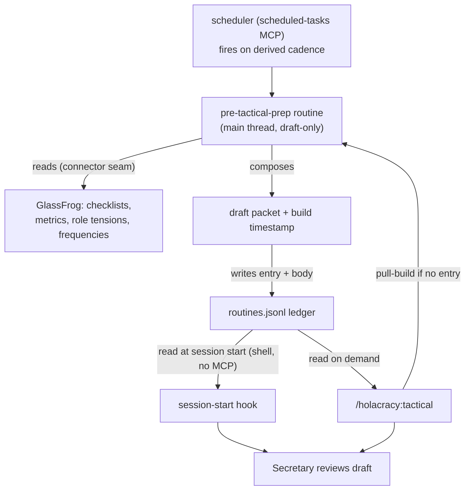

# feat: Secretary pre-Tactical-prep routine (first agentic routine + minimal mechanism)

## Summary

Build the plugin's first agentic routine — a Secretary pre-Tactical-prep routine that assembles a draft prep packet from live GlassFrog data ahead of a circle's expected Tactical cadence and surfaces it through the session-start hook. v1 also stands up the minimal routine *mechanism* (register / fire / store / surface) that exists only as a read-half today. The substrate is a **bridge**: a scheduler fires the routine, the routine writes the `routines.jsonl` entry plus packet body, and the existing hook surfaces it — with `/holacracy:tactical` as the pull fallback when no scheduler is present.

---

## Problem Frame

Under load the Tactical rhythm lapses first — meetings get skipped because no one has time to prep, and the operating cadence quietly dies (see origin: `docs/brainstorms/2026-06-17-secretary-pre-tactical-prep-routine-requirements.md`). An agent can't make people meet, but it can remove the prep cost that makes skipping the easy choice. The plumbing was scaffolded but never built: the hook reads a ledger, `commands/tactical.md` looks for a routine's output, and a scheduled-work preamble exists — but nothing fires, registers, or stores a routine. v1 builds that missing half, with this routine as its first instance.

---

## Key Technical Decisions

- **KTD1 — Substrate bridge (resolves origin Q1).** The scheduler (the `scheduled-tasks` MCP where present) fires the routine; the routine runs in the main Claude thread, composes the packet, and writes a `routines.jsonl` entry plus packet body; the session-start hook reads that ledger to surface it. `/holacracy:tactical` reads the same ledger and also pull-builds the packet on demand when no scheduled output exists. Each substrate does what it is good at — MCP schedules and executes, the shell-readable ledger surfaces. Captured as ADR-0006 (U1).
- **KTD2 — No GlassFrog in the hook.** Hooks run as plain shell with no MCP access (`hooks-handlers/session-start.sh:23-34`). All GlassFrog reads happen in the routine's main-thread execution, never in the hook; the hook only reads the ledger.
- **KTD3 — Packet built only from readable tools.** Compose from `glassfrog_list_checklist_items`, `glassfrog_list_metrics`, `glassfrog_list_role_tensions`, `glassfrog_list_frequencies`. "Projects lacking recent updates" and "overdue/next actions" stay deferred — no read tools exist (origin Dependencies).
- **KTD4 — Cadence is derived, never read.** GlassFrog exposes no meeting-occurrence API. Derive expected cadence from `glassfrog_list_frequencies` or take a Secretary-declared cadence; never assert a last-meeting date (origin R6, AE1, AE2).
- **KTD5 — Identity in the prompt, draft-only.** The routine carries the canonical scheduled-work preamble verbatim (`skills/shared/actor-and-role-resolution.md:102-117`), including the "Draft only" safeguard, and uses the title `holacracy/secretary/pre-tactical-prep/<circle>` so the hook's `holacracy/` filter works.
- **KTD6 — Mechanism vs content separation (honors ADR-0005 seam).** The reusable routine mechanism lives in a new `skills/shared/agentic-routines.md`; the Secretary-specific packet logic lives with the Secretary skill. GlassFrog calls stay behind the governance-data boundary; degraded-mode behavior mirrors `agents/tension-capture.md`.
- **KTD7 — Ledger schema extension, parse-contract preserved.** Extend the existing entry shape (`id`, `title`, `next_fire`, `last_fire`, `last_status`) with: a packet-body carrier (encoding decided by the U9 spike — inline field or sidecar path), a build timestamp for AE3's "as of" marker, and a surfacing window (`surface_from` / `surface_until`) so the hook shows the packet across the prep-to-meeting window rather than only on the exact `next_fire` day. The hook's existing parse must keep working unchanged for entries that lack the new fields.

---

## High-Level Technical Design

The bridge: the scheduler fires the routine; the routine reads GlassFrog and writes the ledger; two surfacing surfaces (hook, command) read the ledger.



Degradation: no scheduler → no proactive fire, but `/holacracy:tactical` still pull-builds the packet (F3). GlassFrog down → no packet, name the gap (F4/AE4). Partial GlassFrog → available sections plus per-section gap markers (AE5).

---

## Output Structure

New and touched files (repo-relative):

```
skills/shared/agentic-routines.md          # new — routine mechanism spec (U2)
skills/holacracy-secretary/
  references/pre-tactical-prep-routine.md   # new — Secretary routine definition (U4)
commands/routines.md                        # new — minimal registration/list command (U7)
hooks-handlers/session-start.sh             # modified — surface packet body + "as of" (U5)
commands/tactical.md                        # modified — read ledger substrate (U6)
docs/adr/0006-*.md                          # new — substrate-bridge decision (U1)
README.md                                   # modified — roadmap + version note (U8)
skills/holacracy-secretary/SKILL.md         # modified — version bump + routine link (U4, U8)
```

The per-unit **Files** sections are authoritative; this tree is the scope shape.

---

## Implementation Units

### Phase 0 — De-risking spike

### U9. Probe the scheduled-tasks MCP surface (decision gate)

- **Goal:** Confirm the `scheduled-tasks` MCP's real `create` / `list` / output-storage semantics before the ledger schema and mechanism spec are frozen. This is a gate, not a tuning step: a surprising result changes the storage design, not just a parameter.
- **Requirements:** origin Q1.
- **Dependencies:** none — runs first. (Sequenced first despite its U9 id; U-IDs are stable handles, not order.)
- **Files:** none — investigation; the outcome is recorded in ADR-0006 (U1) and the U2 spec.
- **Approach:** Probe `mcp__scheduled-tasks__create_scheduled_task` / `list_scheduled_tasks` / `get` live for: whether a task can carry/return per-fire output, the title/scheduling fields available, and the cadence semantics. Decide the packet-body encoding (inline ledger field vs sidecar path) from what the MCP actually supports. **Decision gate:** if the MCP cannot store or return routine output, the routine itself writes the ledger entry + body (no reliance on MCP output storage), and U2's spec reflects that before it is written. Heed the `glassfrog-v5-inherited-context-single-call.md` lesson — the constraints have been wrong before; trust the live probe.
- **Test expectation:** none — spike.
- **Verification:** the MCP's output-storage behavior is documented, the packet-body encoding decision is made, and ADR-0006 records it — all before U2 begins.

### Phase 1 — Mechanism

### U1. ADR-0006: substrate-bridge decision

- **Goal:** Record the Q1 resolution (scheduler fires → ledger surfaces) and its rationale before code is written.
- **Requirements:** origin R1, R8, Q1.
- **Dependencies:** none.
- **Files:** `docs/adr/0006-routine-substrate-scheduler-fires-ledger-surfaces.md`
- **Approach:** Nygard template (matches ADR-0001..0005). Context: the inconsistent anticipatory scaffolding (hook reads `routines.jsonl`; commands read the `scheduled-tasks` MCP; hooks can't call MCP; the MCP isn't bundled). Decision: the bridge (KTD1) with the ledger as the single read substrate. Consequences: both surfacing paths converge on the ledger; proactive firing depends on the scheduler MCP being present, with pull-build as the floor. Reserve 0006 after re-checking `docs/adr/`, the memory dir, and open PRs.
- **Patterns to follow:** `docs/adr/0005-holacracy-identity-glassfrog-as-first-connector-behind-a-seam.md`.
- **Test expectation:** none — ADR document.
- **Verification:** ADR-0006 exists, Accepted, and the plan's KTD1 references it.

### U2. Routine mechanism spec — `skills/shared/agentic-routines.md`

- **Goal:** Define the reusable routine-catalog mechanism: how a routine is registered, fired, stored, and made discoverable — the spec README:104 reserves.
- **Requirements:** origin R1, R2, R3, R10.
- **Dependencies:** U1, U9 (the spike's output-storage decision sets the ledger schema below).
- **Files:** `skills/shared/agentic-routines.md` (new)
- **Approach:** Specify (a) the routine title convention `holacracy/<role>/<routine>/<scope>`; (b) the canonical scheduled-work preamble by reference to `skills/shared/actor-and-role-resolution.md` (do not duplicate it); (c) the ledger entry contract including the KTD7 schema extension (packet-body carrier + build timestamp) and the rule that new fields are optional so the hook's existing parse is unaffected; (d) the draft-only / never-auto-act safeguard by reference to `skills/shared/tension-capture-flow.md`; (e) the fire→read→compose→write→surface lifecycle. No frontmatter version (shared files carry none).
- **Patterns to follow:** the structure of `skills/shared/tension-capture-flow.md` and `skills/shared/actor-and-role-resolution.md`.
- **Test expectation:** none — markdown spec; exercised by U3/U4.
- **Verification:** the spec defines the entry schema, the title convention, and the safeguard references; a reviewer can build U3 and U4 from it without inventing the mechanism.

### U3. Ledger writer + fire path (stub-validated)

- **Goal:** Build the firing/storage half: a routine, when fired, runs and writes a conformant `routines.jsonl` entry plus packet body. Prove the mechanism with a stub payload before any packet content exists.
- **Requirements:** origin R1, R7.
- **Dependencies:** U2, U9 (the spike confirmed the MCP surface this unit builds on).
- **Files:** the ledger-writer mechanism (concrete paths fixed by U2's spec and reflected in the Output Structure tree before this unit starts — main-thread routine execution, not the hook); a stub routine payload for validation.
- **Approach:** Building on the U9 probe (the MCP surface and output-storage decision are settled, not re-discovered here). Implement: on fire, run the routine, then append/update the actor's `~/.claude/holacracy/routines.jsonl` entry (honoring `HOLACRACY_ROUTINE_LEDGER`) with `next_fire`, `last_fire`, `last_status`, the packet body/sidecar, the build timestamp, and the surfacing window. A stub routine that writes a fixed packet validates the write→surface path; firing that stub through the live `scheduled-tasks` MCP validates the trigger path.
- **Patterns to follow:** the ledger field shape parsed in `hooks-handlers/session-start.sh:43-50,81-97`.
- **Test scenarios:**
  - Stub routine writes → a well-formed JSONL entry is appended with all required fields and `last_status: ok`.
  - Entry `title` begins with `holacracy/` so the hook filter matches.
  - Re-fire updates `last_fire`/`next_fire` without corrupting prior lines.
  - Fire failure → entry written with `last_status: error` (drives the hook's anomaly path).
  - `HOLACRACY_ROUTINE_LEDGER` override is honored (enables isolated test ledgers).
  - The stub is triggered through the live `scheduled-tasks` MCP (not just invoked manually) and produces the same entry.
- **Verification:** two distinct acceptances, neither substituting for the other. (a) **Write→surface:** a stub-written entry surfaces in a fresh session and legacy entries round-trip through `session-start.sh` unchanged. (b) **Fire path:** the routine is actually triggered by the live `scheduled-tasks` MCP and writes a conformant entry — a green (a) never stands in for an unproven (b).

### Phase 2 — Secretary routine (packet content)

### U4. Secretary pre-Tactical-prep routine definition

- **Goal:** Define the routine that composes the draft packet from GlassFrog and teaches on the judgment calls.
- **Requirements:** origin R4, R5, R6, R10, R11; F1; AE1, AE2, AE4, AE5, AE6.
- **Dependencies:** U2, U3.
- **Files:** `skills/holacracy-secretary/references/pre-tactical-prep-routine.md` (new); `skills/holacracy-secretary/SKILL.md` (link + version bump).
- **Approach:** Carry the scheduled-work preamble (KTD5). Resolve the acting Secretary agent/role/circle per `skills/shared/actor-and-role-resolution.md`, scoped to the one role (never bulk-load the roster — `glassfrog-v5-inherited-context-single-call.md`). Compose from the readable tools (KTD3): checklist status, metrics due/out-of-range, unprocessed role tensions as candidate agenda items. Derive cadence (KTD4): from `glassfrog_list_frequencies` or Secretary-declared; flag null/invisible frequencies; never assert a last-meeting date. Annotate rationale only where prep judgment is non-obvious (R11) — e.g., why an unprocessed tension is agenda-worthy — not on self-evident items. Draft-only; never file or process tensions (ADR-0003, `tension-capture-flow.md`). Degrade: GlassFrog absent → no packet, name the gap (F4/AE4); partial → available sections + per-section gap markers (AE5).
- **Patterns to follow:** `agents/tension-capture.md` (draft-only, name-the-gap-don't-fabricate, canonical-references list); the Secretary GlassFrog task→tool table in `skills/holacracy-secretary/SKILL.md:23-30`.
- **Execution note:** the connector reads stay behind the governance-data seam (ADR-0005) so a future GlassFrog repoint touches the connector, not this routine.
- **Test scenarios:**
  - Covers AE1. Frequencies imply weekly → packet states "Tactical expected weekly; last occurrence unknown," no invented date.
  - Covers AE2. No derivable cadence → packet asks the Secretary to declare it.
  - Covers AE5. Tensions call fails, others succeed → available sections render; the tensions section carries an explicit gap marker.
  - Covers AE6. An unprocessed tension is listed with its rationale; a simply-due checklist item is listed without added rationale.
  - Covers AE4. GlassFrog unavailable → no packet, gap named, no other action.
  - Connector-gated elements (projects-without-updates, actions) are absent from the packet with no error.
- **Verification:** a fired routine against a live circle produces a draft packet matching AE1, AE2, AE4, AE5, AE6 (AE3's "as of" surfacing is U5); output is a draft only, with no GlassFrog writes.

### Phase 3 — Surfacing & reconciliation

### U5. Surface the packet through the session-start hook

- **Goal:** Make the hook surface the packet summary and its freshness across the prep window, safely.
- **Requirements:** origin R8; F2; AE3.
- **Dependencies:** U3.
- **Files:** `hooks-handlers/session-start.sh` (modified)
- **Approach:** When an entry's surfacing window (`surface_from`/`surface_until`, KTD7) covers today, surface a short summary plus the "as of `<build time>`" marker (AE3) and a pointer to the full draft (F2) in the SessionStart briefing — a window match, not the existing exact-`next_fire`-day match, so the packet shows through the prep-to-meeting window rather than on a single day. **Surface a hook-sanitized summary, not the raw packet body** — pass the briefing to the envelope-encoder via stdin/argv rather than shell-interpolating it into the Python triple-quoted literal, so arbitrary GlassFrog text (including `"""` or trailing backslashes) cannot break the heredoc and silently drop the envelope. Preserve every fail-silent gate and keep entries without the new fields rendering exactly as today.
- **Patterns to follow:** the existing briefing-assembly + envelope at `hooks-handlers/session-start.sh:81-140`.
- **Execution note:** the briefing-encoding change touches the fail-silent contract — add the heredoc-injection regression test before changing the encoder.
- **Test scenarios:**
  - Entry whose surfacing window covers today → briefing includes the summary, "as of `<build time>`", and a full-draft pointer.
  - Entry with a packet body containing `"""` and a trailing backslash → envelope still renders; nothing is dropped.
  - Legacy entry without the new fields → renders exactly as before (no regression).
  - Unreadable ledger / missing `python3` / malformed line → silent `exit 0` (fail-silent preserved).
  - Entry with `last_status: error` → still surfaces under the anomaly list.
- **Verification:** opening a session within the prep window shows the summary + freshness + pointer; a packet body with shell/heredoc metacharacters renders safely; removing the packet body falls back to the legacy metadata briefing; corrupt input stays silent.

### U6. Repoint `/holacracy:tactical` to the ledger substrate

- **Goal:** Converge `/holacracy:tactical`'s surfacing on the same ledger the hook reads, and make the "no routine on file" fallback truthful.
- **Requirements:** origin R8; F3; Q1.
- **Dependencies:** U3.
- **Files:** `commands/tactical.md` (modified).
- **Approach:** In `commands/tactical.md`, replace the `mcp__scheduled-tasks__list_scheduled_tasks`-only routine lookup with a read of the reconciled ledger (per KTD1), filtered to the `holacracy/secretary/pre-tactical-prep/<circle>` title. When no ledger entry exists, pull-build the packet on demand (F3) rather than only reporting absence. Keep the existing "v0.3 feature" fallback wording truthful for the no-routine case. Scope is `/holacracy:tactical` only: `commands/context.md` (routine *inventory*, a different query — scheduled-future vs past-output) and `commands/governance.md` (the deferred pre-*governance*-prep routine) are deliberately left on their current path; converging them belongs with the governance routine, not this v1 (origin defers Governance).
- **Patterns to follow:** the routine-lookup step at `commands/tactical.md:18`; the roster render in `commands/context.md:60-64`.
- **Test expectation:** none — command markdown; behavior validated via U4/U5 acceptance examples.
- **Verification:** `/holacracy:tactical <circle>` surfaces a stored packet when present and pull-builds when absent, reading the same ledger as the hook; `commands/context.md` and `commands/governance.md` are untouched.

### Phase 4 — Registration & ship

### U7. Minimal `/holacracy:routines` registration command

- **Goal:** Give the Secretary a lean way to turn the routine on for a circle and list active routines (origin Q5).
- **Requirements:** origin R2; Q5.
- **Dependencies:** U2, U3.
- **Files:** `commands/routines.md` (new); `hooks-handlers/session-start.sh` (footer reconcile); `README.md` (reconcile).
- **Approach:** A thin command that registers a pre-tactical-prep routine for a resolved circle by creating a scheduled task titled `holacracy/secretary/pre-tactical-prep/<circle>` carrying the canonical preamble (KTD5), and that lists active `holacracy/`-prefixed routines. Resolve actor/role/circle first, then announce, mirroring the resolve-then-announce discipline of existing commands. Keep registration minimal — polished registration UX is deferred (Scope Boundaries). **Name reconcile:** the hook footer (`session-start.sh:116`) and the README roadmap currently point at `/holacracy:routines:list`; `commands/routines.md` resolves to `/holacracy:routines`. Pick one — a `routines/list.md` file to yield `/holacracy:routines:list`, or settle on `/holacracy:routines` and update the two references — so the surfaced invocation actually exists.
- **Patterns to follow:** `commands/context.md` (resolve-then-render roster) and `commands/tactical.md` (frontmatter + structure).
- **Test expectation:** none — command markdown; the created task's title/preamble are validated by U3's fire path and U5's surfacing.
- **Verification:** running the command registers a correctly-titled routine that subsequently fires (U3) and surfaces (U5); the list view shows active routines.

### U8. README roadmap, version, and ship discipline

- **Goal:** Align docs and version mechanics with the landed routine.
- **Requirements:** none (release hygiene).
- **Dependencies:** U1–U7.
- **Files:** `README.md` (modified); `skills/holacracy-secretary/SKILL.md` (frontmatter `version:` bump).
- **Approach:** Update the README "What's coming" section — the agentic-routines line is slotted under v0.4 but the live version is already 0.5.0, so reflect that the mechanism + first routine ship now. Bump the Secretary skill's frontmatter `version:` (currently `1.2.1`). Do not hand-edit `.claude-plugin/plugin.json`, `version.txt`, or the release manifest — land the work behind a `feat:` commit and let release-please open the release PR (next minor).
- **Patterns to follow:** `release-please-config.json`; CLAUDE.md "Versioning".
- **Test expectation:** none — docs/metadata.
- **Verification:** README roadmap matches shipped state; the Secretary skill version is bumped; the branch carries a `feat:` commit so release-please computes the minor bump.

---

## Scope Boundaries

**Deferred for later (from origin):**
- Stage 2 (cost-visibility on cadence slip) and Stage 3 (async-minimum substitute).
- Push / out-of-session delivery (the buried-Secretary blind spot).
- Other meeting types (Governance) and other roles' routines.
- Skip / occurrence detection.

**Outside this product's identity (from origin):**
- The routine running the meeting, or processing tensions and making decisions — draft-only is the line.

**Deferred to Follow-Up Work (plan-local, file as issues):**
- Connector-gated packet elements — "projects lacking recent updates" and "overdue/next actions" — pending GlassFrog read tools (no action-read tool; `list_projects` has no update timestamp).
- Q2: custom-frequency blind spot in cadence derivation (`list_frequencies` omits unassigned custom frequencies).
- Q3: lead-time default tuning (how far ahead of cadence the routine fires).
- Polished registration UX beyond the minimal command (U7).

---

## Risks & Dependencies

- **The scheduler MCP isn't bundled.** Proactive firing depends on the `scheduled-tasks` MCP being present in the user's session; the plugin can't assume it. U3 must ground-truth its create/list/output semantics before building, and pull-build (U6) is the portable floor when it's absent.
- **GlassFrog API drift.** Reads rest on the current GlassFrog MCP (v5 today; a v3→v4/GraphQL migration is in motion per ADR-0005). Keep reads behind the connector seam and re-probe live; the constraints doc has been load-bearing-wrong before.
- **Hook fail-silent contract.** U5 must not introduce any failure path that breaks the hook's silent-on-error guarantee.
- **Same-session list-back unreliability (ADR-0003).** Don't rely on reading back a just-created scheduled task within the same session for confirmation.

---

## System-Wide Impact

- `skills/shared/agentic-routines.md` becomes the template every future routine (post-tactical audit, weekly self-audit) inherits — design U2 for extension, not tight to this one case (review residual concern).
- Repointing `/holacracy:tactical` onto the ledger (U6) is a convergence: after this lands, the hook and `/holacracy:tactical` must always read the same ledger, or the two surfacing paths drift. `commands/context.md` and `commands/governance.md` stay on their current path until the governance routine ships.

---

## Open Questions

**Gated by the U9 spike (resolve before U2):**
- The `scheduled-tasks` MCP's real create/list/output API surface, and whether it stores per-fire output.
- The packet-body encoding — inline ledger field vs sidecar path — which follows from what the MCP supports.

**Deferred to implementation:**
- The default fire lead-time and the surfacing-window width before expected cadence (Q3) — tuning values chosen during U3/U4, not blockers.

---

## Sources & Research

- Origin requirements: `docs/brainstorms/2026-06-17-secretary-pre-tactical-prep-routine-requirements.md`.
- Verified grounding dossier (file:line quotes): `/tmp/compound-engineering/ce-brainstorm/practice-holding/grounding.md`.
- `hooks/hooks.json`, `hooks-handlers/session-start.sh:23-34,36,43-50,81-140` — hook read-half, fail-silent contract, ledger schema, no-MCP constraint.
- `commands/tactical.md:18`, `commands/context.md:16,60-64`, `commands/governance.md:20` — the scheduled-tasks MCP references to repoint.
- `skills/shared/actor-and-role-resolution.md:98-119` — scheduled-work preamble, "Draft only", title convention.
- `skills/shared/tension-capture-flow.md:124-127` — never-auto-act / no AI-agent self-filing.
- `skills/holacratic-ai-governance/references/glassfrog-api-constraints.md` — no action-read tool, `list_projects` has no update timestamp, `list_frequencies` omits custom frequencies, no occurrence data.
- `docs/solutions/tooling-decisions/glassfrog-v5-inherited-context-single-call.md` — ground-truth the live MCP surface; scope reads to one role.
- `docs/adr/0003`, `0004`, `0005` — draft-and-confirm / self-filing deferred; opt-in single-role context; connector seam.
- `release-please-config.json`, CLAUDE.md "Versioning" — commit-driven version bump.
