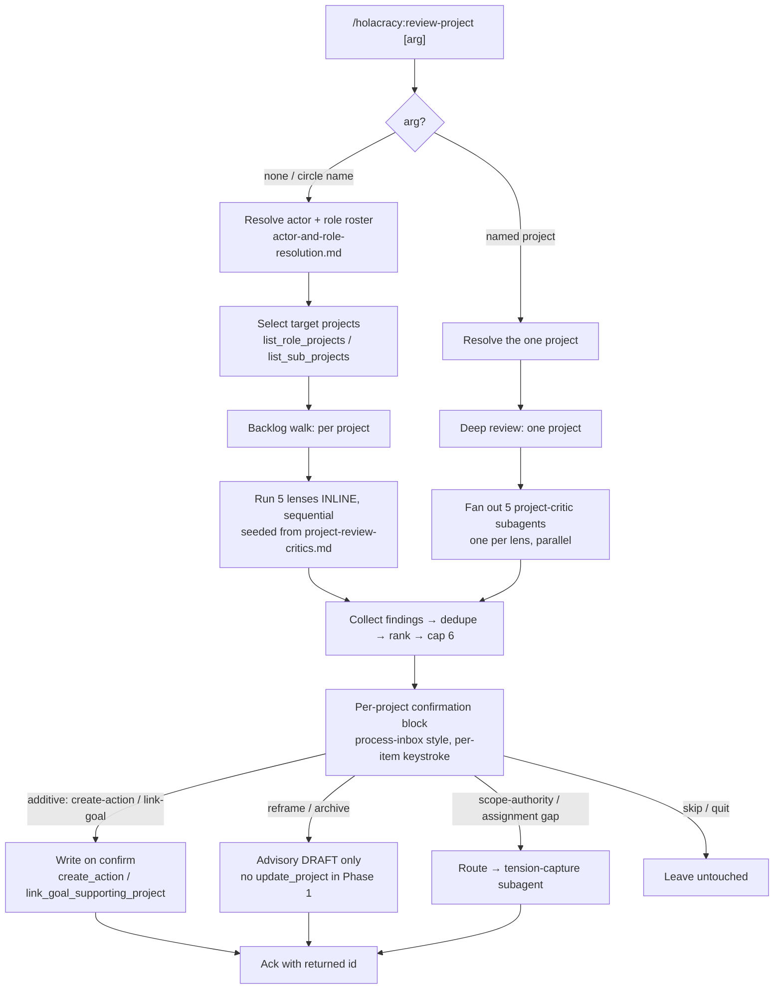

# GlassFrog Project Triage — Phase 1: `/holacracy:review-project` + well-formedness rubric - Plan

> **Product Contract preservation:** unchanged. `ce-plan` enriched this artifact with the Planning Contract (KTDs, technical design, implementation units, verification) without altering the product scope, requirements, or success criteria below.

---

## Goal Capsule

- **Objective.** Give a role-filler an honest, multi-lens critique of a GlassFrog project (or their whole role backlog), with drafted fixes they confirm one at a time — turning "captured but thin" projects into well-formed, well-placed ones, and teaching what good looks like in the process.
- **Product authority.** Kraig Parkinson (governance-champion + primary maintainer).
- **Open blockers.** None. Ship the shared rubric (U1) first; the command (U3) and everything else builds on it.

---

## Product Contract

### Problem

Projects get captured in GlassFrog with ease but arrive under-specified: the description reads as an activity rather than an outcome, there is no stated definition of done, and often no next physical action. Some are also mis-*placed* — serving no goal, exceeding the owner role's authority, or sitting on the wrong role. No surface in the plugin reviews project quality; the project backlog fills with items nobody can act on without re-thinking them first. This is the direct project-side analog of the tension `capture→processing` gap the plugin already addresses for tensions.

### Primary actor & beneficiaries

- **Primary actor.** A role-filler reviewing the projects on the roles they fill (backlog mode), or anyone pressure-testing one specific project before committing to it (deep mode).
- **Secondary beneficiary.** The governance champion, whose health metric is the org-wide project `capture→movement` ratio.

### Desired outcome

Running `/holacracy:review-project` produces a per-project critique across five lenses, each finding paired with a drafted fix. The human confirms fixes one at a time; additive fixes are written to GlassFrog on confirm; the review models good project form so the practitioner needs it less over time (the strategy's declining-correction-dependence bet).

### In scope (Phase 1)

1. **Shared rubric** — `skills/shared/project-well-formedness.md` (U1), structured like `skills/shared/tension-triage.md`, loaded by every project surface. Two families:
   - **Well-formed (actionable):** outcome-framed (end-state, not activity)? has ≥1 concrete next-action? clear owner role? implicit definition-of-done legible?
   - **Well-placed:** supports a goal/target? scope within the owner role's accountabilities/domains? on the best-fit role/filler?
   - Plus the **state vocabulary** (well-formed / needs-outcome / needs-next-action / needs-owner / needs-goal / out-of-authority / stale / blocked) and the **DoD-as-body-convention** decision (GlassFrog has no DoD field and status is freeform text).
2. **`/holacracy:review-project` command** (U3), arg-gated: **no argument** → walk the actor's own role projects one at a time; a **circle name** → walk that whole circle's projects (the circle's roles + sub-roles); a **named/identified project** → deep single-project review (U4). Both backlog target sets use the `process-inbox` per-item shape.
3. **Five critic lenses**, each grounded on the rubric: **actionability**, **goal-alignment**, **scope-authority**, **assignment-fit**, **red-team**.
4. **Execution shape.** Backlog walk runs the lenses as **inline sequential passes**; a named-project deep review **fans out one independent critic subagent per lens** (U4).
5. **Findings handling.** Per project: dedupe, severity-rank, cap (over-critique guard); present in one confirmation block.
6. **Fix application (draft-and-confirm, per-item, never batched):** additive → write on confirm (`create_action`, `link_goal_supporting_project`); destructive → advisory draft only (reframe, archive); advisory-only lenses (scope-authority, assignment-fit) route to governance / Lead Link / a sensed tension (U5).

### Out of scope (Phase 1)

- The capture-time guardrail (`#75`, Phase 2) and the stalled-project sweep (`#76`, Phase 3).
- Description reframe and archive **as writes** — advisory drafts only in Phase 1.
- Any auto-action: auto-write, auto-reassignment, auto-archive, governance changes.
- Scheduling the review as an agentic routine (belongs to the sweep).
- Person-fit judgements beyond a light, opt-in surface — assignment-fit defaults to the structural role-fit reading.

### Requirements

- **R1.** The rubric reference exists and gives each of the seven dimensions a concrete test (e.g. substitution test: "handed to another role-filler cold, could they act?").
- **R2.** The command resolves actor + role roster via `skills/shared/actor-and-role-resolution.md`, then selects targets per the arg gate.
- **R3.** Each lens produces zero or more findings carrying: dimension, severity, a one-line plain-language gap statement, and (where applicable) a drafted fix.
- **R4.** Findings are deduped and severity-ranked; low-severity nitpicks are filtered below a floor; a per-project cap prevents a wall of findings.
- **R5.** Every write is preceded by a per-item human confirmation; no batched writes; the user can quit the walk at any point leaving the rest untouched.
- **R6.** Additive fixes write via `glassfrog_create_action` / `glassfrog_link_goal_supporting_project`; the returned id is the same-session confirmation (do not list-back to verify). The `create-action` payload MUST carry the reviewed project's id so the action attaches to *that project* (not a bare role) — otherwise the fix "succeeds" without closing the next-action gap; pin the exact `glassfrog_create_action` signature during ce-work (see Open Questions).
- **R7.** Description reframe and archive are shown as drafts with the exact text/action the human would apply; the command does not call `glassfrog_update_project` for them in Phase 1.
- **R8.** Scope-authority findings reason from `skills/shared/authority-boundaries.md` (as `/holacracy:check-authority` does) and, on a confirmed structural gap, route into the tension-capture flow rather than editing the project.
- **R9.** Assignment-fit defaults to the structural role-fit reading; the person-fit reading only surfaces on explicit user request.
- **R10.** Write failures are surfaced honestly (never silently swallowed), matching the process-inbox / capture-tension error contract.
- **R11.** The command degrades gracefully if a needed read tool is unavailable on an older MCP server (name the constraint, continue with the lenses that can run).

### Success criteria / acceptance signals

- Running on a deliberately thin project surfaces at least the missing-next-action and activity-vs-outcome findings, each with a drafted fix.
- Confirming a next-action fix creates it in GlassFrog (verified by the `create_action` response id).
- No write occurs anywhere without a per-item human keystroke.
- Scope-authority and assignment-fit findings never produce a write — they route to the right forum.
- On a well-formed project, the panel returns few or no findings (no manufactured critique).

---

## Key Technical Decisions

- **KTD1 — Additive writes on confirm; destructive advisory.** `create_action` + `link_goal_supporting_project` fire on per-item confirm; description reframe + archive stay drafts the human applies. _(session-settled: user-directed — chosen over "apply all confirmed fixes" and "review-only": protects the role-filler's authorship of their own project wording while still closing the highest-value next-action/goal gaps.)_
- **KTD2 — Arg-gated run target.** No arg / circle → backlog walk; named project → deep single-project review. _(session-settled: user-directed — chosen over single-only and backlog-only: one command serves both "triage my backlog" and "pressure-test this project".)_
- **KTD3 — Inline for backlog, independent subagents for deep single-project.** _(session-settled: user-directed — chosen over always-inline and always-subagents: couples multi-agent cost to scope; a 10-project backlog stays affordable, a single deep review gets genuine adversarial independence.)_
- **KTD4 — Three-file structure + one new subagent.** Rubric (`skills/shared/project-well-formedness.md`) and critic spec (`skills/shared/project-review-critics.md`) are separate shared references; the command (`commands/review-project.md`) orchestrates; a new `agents/project-critic.md` powers deep-mode fan-out. Rationale: the rubric is shared by three future surfaces (#74/#75/#76) so it must stand alone; splitting the critic prompts + finding schema into their own reference lets **both** the inline passes and the independent subagents seed from one spec (no drift between modes).
- **KTD5 — Finding schema.** `{ lens, dimension, severity, statement, drafted_fix{ kind, payload }, write_class }` where `lens ∈ {actionability, goal-alignment, scope-authority, assignment-fit, red-team}`, `write_class ∈ {additive-on-confirm, advisory-draft, advisory-route}`, `drafted_fix.kind ∈ {create-action, link-goal, reframe-description, archive, route-to-tension, none}`. One schema for inline and subagent modes.
- **KTD6 — Severity model + cap.** Four levels `blocking > high > moderate > low`; the floor drops `low`; per-project cap of **6** findings, keeping highest severity. Backlog walk shows a one-line per-project verdict — **the state of the project's highest-severity surviving finding, or `well-formed` when none survive** — and expands findings only for non-well-formed projects; deep mode always expands. Note: `stale` and `blocked` in the vocabulary are **reserved for the sweep (#76)** and are not produced by any Phase-1 lens. _(Exact cap and floor are tunable during ce-work — see Open Questions.)_
- **KTD7 — Scope-authority / assignment hand-off reuses `tension-capture`.** A confirmed structural gap dispatches the existing `agents/tension-capture.md` subagent (front-loaded body, role hint, attribution) rather than a new agent or a project write. _(from ideation; reuses proven draft-and-confirm plumbing.)_

**Alternatives considered.** Folding the critic prompts into the command file (rejected — the subagent mode needs a dispatchable spec, and a shared file prevents inline/subagent drift). Inline-only for deep mode (rejected by KTD3 — loses adversarial independence where it is affordable).

---

## High-Level Technical Design



The command is the orchestrator; the two shared references are its spec; the subagent is deep-mode's independence. The confirmation block is the only place writes originate, and every write path is per-item.

---

## Output Structure

```
holacracy-claude-plugin/
├── commands/
│   └── review-project.md          U3  (new — the slash command)
├── agents/
│   └── project-critic.md          U4  (new — deep-mode per-lens subagent)
└── skills/
    └── shared/
        ├── project-well-formedness.md   U1  (new — the rubric, #73)
        └── project-review-critics.md    U2  (new — lens prompts + finding schema)
```

Modified: `README.md`, `CLAUDE.md`, `.claude-plugin/plugin.json` (U6).

---

## Implementation Units

### U1. Well-formedness rubric — `skills/shared/project-well-formedness.md`

- **Goal.** The shared project-quality rubric every project surface loads. Satisfies issue #73.
- **Requirements.** R1.
- **Dependencies.** None.
- **Files.** `skills/shared/project-well-formedness.md` (new).
- **Approach.** Mirror the structure of `skills/shared/tension-triage.md` (numbered steps, "when it feels heavy" coda). Two families (well-formed, well-placed), seven dimensions each with a concrete test and the substitution test. Define the state vocabulary and the DoD-as-body-convention (a `DoD:` line in the description, since there is no field — parallels the tension `[GOVERNANCE]`/`[TACTICAL]` body prefix). Mark which states each surface can produce: `stale`/`blocked` come from the sweep (#76), so Phase-1's review-project never emits them. Name the surfaces that load it (review-project now; capture-guardrail #75, sweep #76 later).
- **Patterns to follow.** `skills/shared/tension-triage.md` (shape); `skills/holacratic-ai-governance/references/glassfrog-api-constraints.md` (freeform status / no DoD field).
- **Test expectation: none** — reference asset. Verification: U3/U4 can cite each dimension unambiguously; relative-path load from the command resolves.

### U2. Critic spec — `skills/shared/project-review-critics.md`

- **Goal.** The five lens prompts + the finding schema + the severity/cap/dedupe rules, written to seed both inline passes and independent subagents.
- **Requirements.** R3, R4.
- **Dependencies.** U1.
- **Files.** `skills/shared/project-review-critics.md` (new).
- **Approach.** One section per lens (actionability, goal-alignment, scope-authority, assignment-fit, red-team): what it reads (name the MCP tools), what it flags against the rubric, its `write_class`. Define the finding schema (KTD5), the severity ladder + floor + per-project cap (KTD6), and the dedupe rule (same dimension + same project → keep highest severity). State the advisory-only constraint for scope-authority and assignment-fit explicitly. **Goal-alignment specifics:** the `link-goal` fix presents the owner role's goals (`list_role_goals`) for a per-item pick (the payload carries the chosen `goal_id`); when the role has **zero goals**, there is nothing to link — surface it as an `advisory-route` ("role has no goal for this project to support"), not an additive write.
- **Patterns to follow.** `skills/shared/tension-triage.md`; `commands/check-authority.md` + `skills/shared/authority-boundaries.md` (scope-authority reasoning).
- **Test expectation: none** — reference asset. Verification: the schema is complete enough that U4's subagent returns parseable findings.

### U3. Orchestrating command — `commands/review-project.md`

- **Goal.** The `/holacracy:review-project` command: arg gate, target selection, backlog inline walk, dedupe/rank/cap, per-project confirmation, additive writes + advisory drafts. Satisfies issue #74 (backlog + confirmation core).
- **Requirements.** R2, R3, R4, R5, R6, R7, R10, R11.
- **Dependencies.** U1, U2.
- **Files.** `commands/review-project.md` (new).
- **Approach.** Frontmatter: `description`, `argument-hint: [project or circle, optional]`. Resolve actor + roles via `skills/shared/actor-and-role-resolution.md`. Arg gate (KTD2): no arg → `list_role_projects` for the actor's own roles; a circle name → that circle's projects (`list_role_projects` across the circle's roles + `list_sub_projects`); a named project → hand to U4's deep path. Both backlog target sets feed the same per-project walk. Per project: run the five lenses inline (seeded from U2), collect findings, dedupe/rank/cap. Present a per-project confirmation block modeled on `commands/process-inbox.md` (per-item keystroke; `[q]` quits leaving the rest). Apply additive fixes on confirm (`create_action`, `link_goal_supporting_project`), trust the returned id (R6), surface reframe/archive as advisory drafts (R7), surface write failures honestly (R10), degrade if a read tool is missing (R11). Backlog shows a one-line verdict per project, expanding findings only for non-well-formed ones (KTD6).
- **Patterns to follow.** `commands/process-inbox.md` (walk + keystroke + summary); `skills/shared/tension-capture-flow.md` (draft-and-confirm, honest-error, no list-back).
- **Test scenarios (dogfood against a live GlassFrog org — no automated harness for prose commands).**
  - Thin project (activity-framed, no action, no goal) → surfaces needs-outcome + needs-next-action + needs-goal findings, each with a drafted fix. _(Covers R3.)_
  - Confirm the drafted next-action → `create_action` fires; ack uses the returned id; no list-back. _(Covers R6.)_
  - Confirm the goal link → `link_goal_supporting_project` fires. _(Covers R6.)_
  - Reframe + archive → shown as drafts; no `glassfrog_update_project` call is made. _(Covers R7.)_
  - Well-formed project → few/no findings; one-line "well-formed" verdict, no expansion. _(Covers R4 / success criteria.)_
  - Backlog walk over a circle → one-line verdict per project; `[q]` mid-walk leaves the remaining projects untouched. _(Covers R5.)_
  - A read tool unavailable → names the constraint, runs the lenses that can. _(Covers R11.)_
- **Verification.** All relative-path loads resolve; the command appears as `/holacracy:review-project`; no write path lacks a per-item confirmation.

### U4. Deep single-project mode — `agents/project-critic.md` + fan-out

- **Goal.** Independent adversarial critique for a single named project: one subagent per lens, in parallel.
- **Requirements.** R3 (via subagents), KTD3.
- **Dependencies.** U2, U3.
- **Files.** `agents/project-critic.md` (new); `commands/review-project.md` (deep-mode branch). _Note: U3, U4, and U5 all modify `commands/review-project.md` — one owner across these units to avoid churn on the shared file._
- **Approach.** Subagent input `{ project data, role context, one lens }`; it loads U1 + U2, applies its lens, returns findings as the KTD5 schema. The command's deep path dispatches five in parallel, then reuses U3's dedupe/rank/cap and confirmation block. `model: inherit` (match `agents/tension-capture.md`).
- **Patterns to follow.** `agents/tension-capture.md` (subagent frontmatter, canonical-references block, "return to dispatcher" contract).
- **Test scenarios.**
  - Deep review on one project → five independent critic subagents dispatched; findings merged, deduped, capped, presented once.
  - A lens with nothing to say → returns zero findings; no manufactured critique. _(Covers success criteria.)_
- **Verification.** Findings from subagent mode parse against the schema and flow through the same confirmation block as inline mode.

### U5. Advisory-route hand-off — scope-authority & assignment → tension-capture

- **Goal.** Turn a confirmed structural gap (out-of-authority scope, wrong-role assignment) into a sensed tension via the existing flow, never a project write.
- **Requirements.** R8, R9.
- **Dependencies.** U3.
- **Files.** `commands/review-project.md`; `skills/shared/project-review-critics.md` (route wording).
- **Approach.** Scope-authority lens reasons from `skills/shared/authority-boundaries.md` (as `/holacracy:check-authority`). On a confirmed structural gap, offer to dispatch `agents/tension-capture.md` with a front-loaded body, role hint, and attribution — the project itself is not edited. Assignment-fit defaults to structural role-fit; person-fit only on explicit user request (R9).
- **Patterns to follow.** `agents/tension-capture.md`; `commands/check-authority.md`.
- **Test scenarios.**
  - A scope-overreach project → advisory finding; on confirm, routes to `tension-capture`; the project record is untouched. _(Covers R8.)_
  - Assignment-fit → structural role-fit surfaced by default; person-fit only when asked. _(Covers R9.)_
- **Verification.** No scope-authority/assignment path calls a project write tool.

### U6. Surface the command — docs + manifest

- **Goal.** Make the new command discoverable and version the bundle.
- **Requirements.** (Product surfacing; no functional requirement.)
- **Dependencies.** U3.
- **Files.** `README.md`, `CLAUDE.md`, `.claude-plugin/plugin.json`.
- **Approach.** Add `/holacracy:review-project` to the README command list and CLAUDE.md; bump `.claude-plugin/plugin.json` version `0.6.1 → 0.7.0` (new command surface = minor) and add keywords (`project-triage`, `project-review`). Note the two new shared references in CLAUDE.md's shared-reference section.
- **Test expectation: none** — docs/manifest.
- **Verification.** `plugin.json` parses; version bumped; command listed.

---

## Verification Contract

These are prose command/skill files with no automated test harness, so verification is (a) structural and (b) dogfood against a live GlassFrog org.

- **Structural gates.** All relative-path references resolve (`../shared/...` intact per CLAUDE.md); command + subagent frontmatter valid; `plugin.json` parses; the command is discoverable as `/holacracy:review-project`.
- **Behavioral gates.** The U3 and U4 dogfood scenarios above pass against a real project, plus: no write occurs without a per-item human keystroke; additive writes trust the returned id (no list-back); scope-authority/assignment never call a project write tool; a well-formed project yields no manufactured findings.

---

## Definition of Done

- U1, U2, U3, U4, U5 shipped; `/holacracy:review-project` discoverable; U6 docs + version bump landed.
- All Verification Contract gates pass against a live GlassFrog org.
- Every write path is per-item confirmed; scope-authority/assignment paths never write to the project.
- The PR body carries `Closes #73` and `Closes #74`; issues move to Done on merge; the Phase 1 items on Project #41 are cleared.

---

## Open Questions (deferred to `ce-work`)

- Exact severity floor and the per-project cap number (KTD6 defaults: drop `low`, cap 6).
- Project-identity resolution in a named-project run (id vs description match) given the same-session list-back caveat.
- Whether the backlog walk pre-filters to obviously-thin projects or reviews every project (default: review all, one-line verdict each).
- Whether goal-alignment also surfaces the reciprocal signal (goals with no supporting project) in Phase 1 or defers it.
- The exact structured-output shape returned by U4's subagents (must satisfy KTD5).
- The exact `glassfrog_create_action` signature (does it take `project_id`, `role_id`, or both?) — the additive next-action fix only closes the gap if the action attaches to the reviewed project; pin against the live server before building U3.

---

## Grounding (verified against the live MCP surface & repo)

- **Reads:** `glassfrog_list_role_projects`, `glassfrog_list_sub_projects`, `glassfrog_get_project`, `glassfrog_list_project_actions`, `glassfrog_list_role_goals`, `glassfrog_list_goal_targets`, `glassfrog_list_goal_supporting_projects`, `glassfrog_list_role_domains`, `glassfrog_get_role_context`, `glassfrog_list_role_assignments`, `glassfrog_list_skills`.
- **Writes (Phase 1, additive):** `glassfrog_create_action`, `glassfrog_link_goal_supporting_project`. _(Both tools exist on the live surface; the exact `create_action` parameter set — project vs role scope — is not yet pinned and is an Open Question below.)_
- **Deferred writes (advisory in Phase 1):** `glassfrog_update_project` (reframe/archive).
- **Constraints:** project status is freeform text (no status machine); no definition-of-done field (⇒ DoD-as-body-convention); same-session list-back is unreliable (⇒ trust creation-response ids). Source: `skills/holacratic-ai-governance/references/glassfrog-api-constraints.md`.
- **Patterns to model on:** `commands/process-inbox.md`, `skills/shared/tension-capture-flow.md`, `skills/shared/tension-triage.md`, `agents/tension-capture.md`, `commands/check-authority.md` + `skills/shared/authority-boundaries.md`.

## Next step

`ce-work` to build U1–U6. On merge, `#73` and `#74` close and Project #41's Phase 1 clears.
