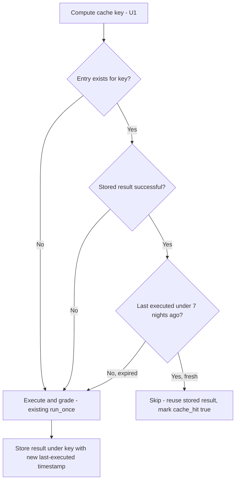

# Nightly Eval Skip Cache - Plan

## Goal Capsule

- Objective: give the nightly graded eval tier (`skills-eval.yml`) a change-aware skip so it only re-executes and re-grades a case/config leg when something that could move its result has actually changed, instead of re-running the full matrix every night regardless of change.
- Product authority: this repo's own CI/eval conventions (`docs/adr/0012`, the `skills-eval.yml` and `scripts-test.yml` headers) are the standing authority; no external product owner.
- Open blockers: none — scope, mechanism, and cache-key basis are settled below.
- Product Contract preservation: restructured, no scope change. R1-R8 kept their brainstorm-assigned meaning; the deferred CLI-pin open question was resolved in place (Success Criteria wording, KTD5) rather than carried forward as an open item, and the two "not resolved here" Dependencies/Assumptions bullets were updated to cite the KTDs that resolved them.

## Product Contract

### Summary

Add a per-leg result cache to the nightly graded eval tier, keyed on everything that could move a leg's result — skill content, case content, fixtures, harness code, requested repeats, model, and CLI version — so a quiet night — nothing in `evals/`, `skills/`, or the harness changed — re-executes nothing, and a night with real changes re-executes and re-grades only the legs whose cache key moved.

### Problem Frame

`skills-eval.yml`'s `graded` job re-executes and re-grades every `(case, config)` leg every night on a fixed cron, regardless of whether the skill, case, fixture, model, or harness changed since the previous run. On a quiet night — most nights, going by the repo's commit cadence — this reproduces a result already measured, at roughly two minutes per execution against a documented ~24 executions plus 24 grading passes per run (`docs/ideation/2026-08-17-eval-token-efficiency-ideation.html`). That same ideation doc already named the fix ("Skip what has not changed") but left the scope of it as an open, three-way decision. This plan resolves that decision and turns it into buildable requirements.

A parallel audit of the two other CI layers that could plausibly also run evals unnecessarily — the per-PR `scripts-test.yml` offline suite, and `skills-eval.yml`'s own `offline` job — found both already correct: `scripts-test.yml` carries a deliberately reasoned rejection of path-filtering, and `offline` gates the expensive `graded` job (`needs: offline`) as a fail-fast check protecting against un-ruled direct pushes to `main`. Neither needed a plan; see Scope Boundaries.

### Requirements

**Cache key and skip decision**

- R1. Before executing a `(case, config)` leg, the runner computes a cache key from: case file content, the skill's declared `version:` field (per `skills-lint.sh` check 4, `scripts/skills-lint.sh:286`), a hash of the shared reference files that skill loads (since check 4 excludes `skills/shared/` from its diff), fixture hash, a hash of the harness's own execution/grading script (`run-behavioural-eval.py`, which participates in producing a leg's result — not `eval-report.py`, a post-hoc renderer that never runs during execution or grading and so cannot move a leg's result), the requested repeat count (`runs`), model id, stub hash, and the invoked Claude Code CLI binary's version.
- R2. When a fresh, successful result already exists for a leg's current key, the runner skips re-execution and re-grading for that leg and reuses the stored result in the run's output.
- R3. When no result exists for a leg's current key, or the stored result under that key was not successful — first run, any input in R1 changed, or a prior attempt under the current key failed — the runner executes and grades that leg normally and stores the result under the current key.
- R4. The cache key's input list (R1) is treated as exhaustive by design: adding a new input that could move a result (a new fixture field, a new CLI flag affecting output) is a required edit to the key, not an optional enhancement, so a cache hit never masks an actual change.
- R7. An automated check flags when the cache key's enumerated list of sensitive input classes drifts out of sync with the key-computation code that reads them — parallel to `skills-lint.sh` check 4's skill-version enforcement — so that drift does not depend solely on manual discovery. Discovering a wholly new sensitive input class not yet added to the enumeration is outside this check's scope and still depends on manual review.

**Freshness bound**

- R8. A leg's cached result has a bounded lifetime: even when its cache key has not changed, the leg is force re-executed at least once every N nights, so a leg with static inputs is still periodically re-verified against live model behavior rather than caching indefinitely.

**Safety net**

- R5. The `--validate-only` session-shape probe (`scripts/run-behavioural-eval.py`, `--validate-only`/`--no-session-probe`) continues to run every night on every leg — cached or freshly executed — so a replayed/cached control still proves it registered no leaked `holacracy:` command.

**Reporting**

- R6. `scripts/eval-report.py`'s output distinguishes a cached leg from a freshly executed one, so a reader of a nightly report can tell a "no news" night from a "everything passed fresh" night.

### Key Decisions

- **Middle scope, not narrowest or widest** (session-settled: user-directed — chosen over Approach A (control-only amortization) and Approach C (retire the unconditional nightly clock)): full quiet-night savings on both control and skill-side legs, without changing what "nightly" means to the team. Governs R1, R2, R3, R4, R7, R8.
- **Cache key uses the skill's declared `version:` field, not a raw content hash** (session-settled: user-directed): reuses `skills-lint.sh` check 4's existing version-bump enforcement (`scripts/skills-lint.sh:296`, `check_version_bump()`) instead of adding a second, independent hashing mechanism for skill content. Governs R1.
- **`scripts-test.yml` and `skills-eval.yml`'s `offline` → `graded` gate stay untouched** (session-settled: user-directed — chosen over reconsidering `scripts-test.yml`'s no-paths-filter stance): the former's rejection of path-filtering is a deliberate, still-valid architectural decision on record; the latter (`needs: offline`, `.github/workflows/skills-eval.yml:93`) is a fail-fast gate against un-ruled direct pushes to `main`, not redundant waste. Governs Scope Boundaries.

### Acceptance Examples

- AE1. **Covers R2.** Given a leg whose cache key matches a stored successful result from a prior night, when the nightly run reaches that leg, then it is skipped and the stored result is reused in the run's output.
- AE2. **Covers R3.** Given a leg whose skill version bumped since the last stored result, when the nightly run reaches that leg, then it executes and grades fresh and the new result replaces the stored one under the new key.
- AE3. **Covers R4.** Given a change to an input not yet included in the cache key (e.g. a new CLI flag that alters output), when that gap is discovered, then the key's input list is extended to cover it rather than left as a silent blind spot.
- AE4. **Covers R7.** Given the key-computation code stops reading one of the cache key's enumerated input classes, when the automated check runs, then it flags the mismatch rather than allowing it to reach production silently.
- AE5. **Covers R8.** Given a leg whose cache key has not changed for N nights, when the bounded-lifetime threshold is reached, then the leg re-executes regardless of the cache hit.
- AE6. **Covers R3.** Given a leg whose stored result under the current key was not successful, when the nightly run reaches that leg, then it executes and grades again rather than being treated as skippable or left unresolved.

### Success Criteria

- On a night where nothing in `evals/`, `skills/`, the harness, or the invoked Claude Code CLI version changed since the previous successful nightly run, the `graded` job executes and grades zero legs, and the report reads as a clean skip rather than a silent no-op.
- On a night where a skill's version bumped, a case file changed, or a fixture/model/stub/CLI input changed, every affected leg — and only the affected legs — executes and grades fresh.
- A cache hit never reports a stale verdict as current for a leg whose actual inputs changed (R4's exhaustiveness discipline holds under review).
- A leg whose cache key has not changed for the bounded lifetime window (R8) still gets a fresh execution at least once per window, rather than caching indefinitely.
- R7's automated check catches drift between the cache key's enumerated input-class list and the code that computes the key; discovering a wholly new, never-enumerated input class still depends on manual code review, same as before this feature existed.

### Scope Boundaries

- `scripts-test.yml` (per-PR offline suite) — not touched; its documented no-paths-filter rationale stands.
- `skills-eval.yml`'s `offline` → `graded` fail-fast gate — not touched; verified as a deliberate safety gate, not duplication.
- A new PR-triggered graded eval tier — out of scope; none exists today and none is being introduced here.
- Measuring or reporting dollar cost savings from the cache — depends on unbundling the token ledger (a separate idea in `docs/ideation/2026-08-17-eval-token-efficiency-ideation.html`, idea #1), not a prerequisite for this plan.
- Approach A (control-only amortization) and Approach C (retire the unconditional nightly clock) — considered and set aside in favor of the middle scope; either could be revisited later once the cache-key mechanism (R1-R4) has run long enough to build confidence in its correctness.

### Dependencies / Assumptions

- Assumes `skills-lint.sh` check 4 continues to enforce that any skill content change bumps `version:` — R1's key relies on that invariant holding, not on independently verifying content hasn't changed.
- Assumes the nightly `graded` job's `contents: write` scope against the dedicated `eval-cache-index` branch (added by KTD1) is not revoked by a future repo-wide permissions tightening or by that branch later being pulled under a protecting ruleset; if either happens, U2's index-push step needs a different persistence mechanism.
- Assumes `aggregate_benchmark.py` (pinned from `anthropics/claude-plugins-official`, `.github/workflows/skills-eval.yml:209`) continues to accept `benchmark.json` unmodified — R6's reporting is deliberately designed around never touching that schema (KTD4).

### Sources / Research

- `docs/ideation/2026-08-17-eval-token-efficiency-ideation.html` — originating ideation, idea "Skip what has not changed"; also the source of the token-ledger dependency noted in Scope Boundaries.
- `.github/workflows/skills-eval.yml` — nightly `offline`/`graded` job structure, `needs: offline` gate (line 93), cron/dispatch-only trigger.
- `.github/workflows/scripts-test.yml` — "Why NO paths: filter" rationale (lines 54-63), confirmed still governing per-PR CI.
- `scripts/skills-lint.sh:286-296` — check 4, the version-bump enforcement the cache key reuses; its `check_version_bump()` diff excludes `skills/shared/` (`grep -v '^skills/shared/'`), the gap R1's shared-file hash closes.
- `scripts/run-behavioural-eval.py:951-966` — `--validate-only` / `--no-session-probe` flags underpinning R5.
- `scripts/glassfrog-fixture-gen.py:42,55` — the repo's only existing content-addressing pattern (`sha256(...).hexdigest()[:32]`), followed by U1's key computation.
- `scripts/run-behavioural-eval.py:1027-1030` — the unconditional per-(case, config, run) `shutil.rmtree` / `run_once` loop U2 hooks a skip branch into.
- `docs/adr/0012-test-the-skills-not-just-the-scaffolding.md` — mutation-testing discipline ("do not add a check without adding its mutation case") governing U4's completeness check.
- `docs/adr/0014-eval-hermeticity-by-config-dir-isolation-not-bare.md` — the opus/haiku benchmark-comparison incident that validates keying on model id, and the "void wholesale, don't silently degrade" precedent behind R8.
- `.github/workflows/skills-eval.yml:209` — `AGGREGATOR_SHA`, pinning `aggregate_benchmark.py` from `anthropics/claude-plugins-official`; the external, unmodifiable dependency behind KTD4.
- GitHub Docs, "Caching dependencies to speed up workflows" — 7-day no-access eviction and last-access-ordered size-cap eviction, verified externally to ground KTD1's rejection of `actions/cache`.
- `gh api repos/Integral-Productivity/holacracy-claude-plugin/rules/branches/main` and `gh api orgs/Integral-Productivity/rulesets/20821950`, verified live during document review — confirms the active "Tier 3 — protect main (auto-merge fix)" ruleset (`bypass_actors: []`) that KTD1's dedicated-branch design routes around.
- `.github/workflows/promote-stable.yml` — this org's existing bypass-actor pattern for pushing to a protected branch (`stable`), the alternative KTD1 considered and did not choose for `eval-cache-index`.
- CLAUDE.md's "Shared reference" section — the nine-broken-load-path incident (`skills-lint.sh` check 1) grounding U1's reuse of that check's path-resolution logic rather than reimplementing it.
- `scripts/run-behavioural-eval.py:1055-1064` — `run_metadata.json`'s actual flat, once-per-run shape, verified during document review to confirm it has no per-leg structure to extend (KTD4).
- `scripts/eval-report.py`, verified during document review — a pure post-hoc renderer of `benchmark.json` that never runs during execution or grading, grounding R1's exclusion of it from the cache key.

## Planning Contract

### Key Technical Decisions

- KTD1. **Cache index is a repo-committed JSON file on a dedicated, unprotected branch — not `main`, and not `actions/cache`.** No workflow in this repo uses `actions/cache`, `hashFiles`, or any GH Actions caching primitive today (confirmed by search) — there is no existing pattern to extend. Verified against GitHub's own docs: cache entries evict after 7 days with no access, and a nightly hit is an access, so an unchanged leg's entry never crosses that threshold — `actions/cache` structurally cannot force R8's periodic re-execution. Cache entries are also immutable (no update-in-place; a changed entry needs a new key), which fits poorly with a shared index that mutates every run regardless. GitHub Actions repo/org `vars` (a config-variable store, up to 48 KB per variable) was considered and rejected: it would work mechanically but drops git-history visibility into how the index changed over time. A repo-committed index therefore stays the right shape — but doc review's feasibility and adversarial passes independently confirmed (`gh api repos/.../rules/branches/main`, `gh api orgs/Integral-Productivity/rulesets/20821950`) that `main` carries an active org ruleset (id 20821950, `bypass_actors: []`) requiring every change to land via a merged pull request; a same-job direct commit from the `graded` job would be rejected by GitHub every night, silently degrading the whole feature to a permanent cache miss. The index instead lives on a dedicated branch (`eval-cache-index`) outside that ruleset's scope — the `graded` job checks it out, updates it, and pushes directly, with no PR and no bypass-actor provisioning needed, since a bypass actor (this org's pattern for `promote-stable.yml`'s push to the protected `stable` branch) requires an org-admin step this plan doesn't need to ask for. Git history on that branch still gives the same diffable audit trail KTD1 originally wanted from `main`. Governs R2, R3, R8.
- KTD2. **R7's completeness check asserts an enumerated list, not a dynamic diff.** A fully dynamic "which files can move a result" detector is unimplementable in general; instead, U1's key-computation code owns one canonical enumerated list of sensitive input classes (`skills/**`, `skills/shared/**`, `evals/cases/**`, `evals/stub/**`, `scripts/run-behavioural-eval.py`), and U4's check is a mutation-tested assertion that the key-computation function actually reads from every class in that list — parallel in spirit to `skills-lint.sh` check 4's `--base`-gated diff, but implemented as a static assertion rather than a git-diff scan, since the property being checked is "does the code cover the list," not "did a file change." Governs R4, R7.
- KTD3. **Bounded cache lifetime defaults to 7 nights.** A round, easily-justified default: frequent enough that model-behavior drift under a stable model id surfaces within a week, infrequent enough to preserve most of the middle-scope savings Key Decision "Middle scope" commits to. Configurable, not load-bearing on the number itself. Governs R8.
- KTD4. **R6's cache-hit reporting never touches `aggregate_benchmark.py`'s input or output schema, and reads from U2's cache index rather than `run_metadata.json`.** `aggregate_benchmark.py` is pinned by commit SHA from `anthropics/claude-plugins-official` (`.github/workflows/skills-eval.yml:209`) — an external dependency this repo cannot modify, and issue #199 already crashed once on an upstream schema change to the very artifact (`benchmark.json`) R6 might otherwise have been tempted to extend. `run_metadata.json` was the first candidate source but doc review confirmed it is a flat, once-per-run aggregate (`scripts/run-behavioural-eval.py:1055-1064`) with no per-leg breakdown to attach a field to — extending it would mean restructuring it, not adding to it. U2's cache index already carries a per-leg record naturally, since that is what the skip/execute decision reads, so a separate report section — independent of `eval-report.py`'s existing baseline-comparison table — renders hit/miss counts from that index instead. Governs R6.
- KTD5. **The deferred CLI-pin question resolves to a wording fix, not a pin.** R1 already keys on the invoked CLI's version, so a CLI release already forces correct re-execution — the gap the doc-review finding named was Success Criteria's "quiet night" prose not naming that input, not a functional hole. Broadened the Success Criteria wording (see Product Contract) rather than pinning the CLI install, which would be a separate reproducibility change with its own tradeoffs. Pinning for general reproducibility is deferred (see Scope Boundaries below).

### High-Level Technical Design

The skip/execute decision (R2, R3, R8) is one branching gate evaluated per `(case, config)` leg — covering all of that leg's requested `runs` together, since `runs` is itself one of R1's key inputs — immediately before the existing unconditional per-run execution loop begins:

This gate replaces nothing in the existing per-leg loop except the unconditional call to `run_once` — the `--validate-only` session-shape probe (R5) sits outside this gate entirely and continues to run on every leg regardless of which branch fires.

### Scope Boundaries (Planning Contract additions)

- **Pinning the Claude Code CLI install for general reproducibility** — a legitimate idea (KTD5), but a separate concern from this feature; deferred to a future plan if pursued.
- **Restructuring `run_metadata.json` to carry per-leg data** — R6's cache-hit reporting sources from U2's cache index instead (KTD4), so `run_metadata.json` stays untouched by this plan.

### Sequencing

U1 → U2 → {U3, U5} in parallel. U4 depends only on U1 and can proceed in parallel with U2 — it checks the key-computation code's own enumeration, not the storage layer U2 adds.

## Implementation Units

### U1. Cache key computation

**Goal:** Compute a stable, content-addressed cache key for each `(case, config)` leg before execution.

**Requirements:** R1, R4, R7 (the key computation is where R4's exhaustiveness and R7's enumerated-class list live)

**Dependencies:** none

**Files:**
- `scripts/run-behavioural-eval.py` — new key-computation function
- `scripts/run-behavioural-eval.test.sh` — new test cases

**Approach:**
1. Add a `compute_cache_key(case, config, ...)` function following the repo's one existing content-addressing pattern (`scripts/glassfrog-fixture-gen.py:42,55`: `sha256(...).hexdigest()`, truncated).
2. Hash inputs per R1: case file content, skill's `version:` field, a hash of the shared reference files that skill's `SKILL.md`/`references/` load, fixture hash (existing), a hash of `run-behavioural-eval.py` only (not `eval-report.py`, which never runs during execution or grading and so cannot move a leg's result — doc review flagged including it as self-defeating, since U5 itself edits that file), the requested `runs` count, model id, stub hash (existing), and the invoked CLI binary's version (`claude --version`, not the harness script's own version — KTD's clarification).
3. Maintain the sensitive-input-class enumeration (KTD2) as a single list constant in this module, consumed by both the key computation and U4's check.
4. Discover which shared files a skill's `SKILL.md`/`references/` actually load by reusing `skills-lint.sh` check 1's own path-resolution routine (extract it into a function both consume) rather than reimplementing citation-scanning independently. This repo has already gotten transitive shared-file path resolution wrong once — CLAUDE.md documents nine broken load paths that sat unnoticed on `main` for months until check 1 started enforcing it — so a second, independent implementation risks repeating that failure mode for the cache key specifically.

**Patterns to follow:** `scripts/glassfrog-fixture-gen.py:42,55` for the hash-and-truncate shape; `scripts/skills-lint.sh` check 1 for shared-file path resolution.

**Test scenarios:**
- Changing each of R1's nine inputs independently produces a different key; changing nothing produces the same key.
- A `skills/shared/` file edit changes the key even when the affected skill's `version:` field is unchanged.
- A shared file cited only from a skill's `references/` file (a `../../shared/X.md` path, one level deeper than a direct `SKILL.md` citation) is still discovered and hashed — the historical failure mode check 1 was built to catch.
- A `run-behavioural-eval.py` edit changes the key; an `eval-report.py`-only edit does not.
- Changing `runs` changes the key.

**Verification:** `bash scripts/run-behavioural-eval.test.sh` covers the new key-computation cases.

### U2. Cache storage, lookup, skip/execute decision, and workflow wiring

**Goal:** Persist per-leg results keyed by U1's key; skip execution on a fresh successful hit (R2), execute on a miss or a stored-but-failed prior attempt (R3); make the index available across nightly runs.

**Requirements:** R2, R3, R5 (verification that the safety-net probe is untouched)

**Dependencies:** U1

**Files:**
- `scripts/run-behavioural-eval.py` — skip/execute branch in the per-`(case, config, run)` loop
- `.github/workflows/skills-eval.yml` — `graded` job: `eval-cache-index` branch checkout/push steps, `contents: write` scope, concurrency group
- `scripts/run-behavioural-eval.test.sh` — new test cases

**Approach:**
1. Insert the skip/execute branch (see High-Level Technical Design) once per `(case, config)` leg, immediately before the existing `for run in range(1, args.runs + 1):` loop that wraps the `if run_dir.exists(): shutil.rmtree(run_dir)` / `run_once(...)` call at `scripts/run-behavioural-eval.py:1027-1030` — not inside the loop, since the decision covers all of that leg's requested runs together.
2. On a hit: synthesize the leg's `grading.json`/`outputs/` from the stored entry, tagging `cache_hit: true`; skip the CLI invocation entirely.
3. On a miss or a stored-failed entry: run the existing flow unchanged, then write the new key → result entry (KTD1's repo-committed index) with a fresh last-executed timestamp.
4. Wire the index into `skills-eval.yml`'s `graded` job: checkout the dedicated `eval-cache-index` branch (KTD1) alongside `main` at job start, read the index, and push the updated index directly to `eval-cache-index` at job end if it changed — no PR, since that branch sits outside `main`'s ruleset. Scope `contents: write` to this job only, and only against `eval-cache-index` — `main` stays untouched by this job's writes, and `offline` and every other workflow stay `contents: read`. Add a `concurrency` group on the `graded` job so a manual dispatch overlapping the nightly cron cannot push the index twice.
5. Verify R5's `--validate-only` probe step is unaffected — it runs on every leg regardless of which skip/execute branch fired.

**Patterns to follow:** `scripts/run-behavioural-eval.py:1047` (existing `run_metadata.json` write) for the index's own JSON-write shape.

**Test scenarios:**
- Covers AE1. A leg whose key matches a stored successful entry is skipped; the CLI is never invoked; the stored result appears in output.
- Covers AE2. A leg whose skill version bumped executes fresh and replaces the stored entry.
- Covers AE6. A leg whose stored entry exists but was not successful executes again rather than being skipped.
- The `--validate-only` probe runs and passes for both a cache-hit leg and a freshly-executed leg.
- Two overlapping `graded` job runs (simulated) do not corrupt the index — the concurrency group serializes them.

**Verification:** `bash scripts/run-behavioural-eval.test.sh`; a `--validate-only` dry run of the workflow's index read/write step.

### U3. Bounded cache lifetime

**Goal:** Force re-execution of a leg at least once every 7 nights (KTD3) even when its cache key is unchanged.

**Requirements:** R8

**Dependencies:** U2

**Files:**
- `scripts/run-behavioural-eval.py` — lifetime check in the skip branch
- `scripts/run-behavioural-eval.test.sh` — new test cases

**Approach:** Extend U2's skip branch with the `last_executed` check from the High-Level Technical Design diagram — a stored entry only satisfies R2's skip condition when both the key matches and the entry is under 7 nights old.

**Test scenarios:**
- Covers AE5. A leg whose key hasn't changed but whose stored entry is 8+ nights old executes fresh.
- A leg whose key hasn't changed and whose stored entry is 3 nights old still skips.

**Verification:** `bash scripts/run-behavioural-eval.test.sh`.

### U4. Cache-key completeness check

**Goal:** A mutation-tested, automated check that fails when U1's enumerated sensitive-input-class list and its actual key-computation code drift apart (R4, R7).

**Requirements:** R4, R7

**Dependencies:** U1

**Files:**
- `scripts/cache-key-completeness-check.sh` (new)
- `scripts/cache-key-completeness-check.test.sh` (new, mutation-checked per ADR-0012)
- `.github/workflows/scripts-test.yml` — new step invoking the check (required by `test-wiring-check.sh`, which fails any `*.test.sh` not wired into a workflow)

**Approach:** Assert that U1's key-computation function references every class named in its own enumeration list (KTD2) — a static/structural assertion, not a git diff. Follow `scripts/skills-lint.sh`'s existing check structure for shape and error-message conventions.

**Test scenarios:**
- Enumeration and implementation in sync → check passes.
- Seeded defect: a class present in the enumeration but not read by the key computation → check fails, naming the missing class.
- Seeded defect: a class read by the key computation but absent from the enumeration → check fails.
- Per ADR-0012's mutation discipline: each seeded defect fails only this check, and this check passes when no defect is seeded.

**Verification:** `bash scripts/cache-key-completeness-check.test.sh`; `bash scripts/test-wiring-check.sh` confirms the new `.test.sh` is wired.

### U5. Reporting: cache-hit/miss visibility

**Goal:** Surface which legs were cache hits vs. fresh executions in the nightly report, without touching `aggregate_benchmark.py` or `benchmark.json`'s schema (R6, KTD4).

**Requirements:** R6

**Dependencies:** U2

**Files:**
- `scripts/eval-report.py` or a new small script — cache-summary section reading U2's cache index directly
- `scripts/eval-report.test.sh` — new test cases
- `.github/workflows/skills-eval.yml` — report step prints the new section alongside the existing baseline comparison

**Approach:** Render a compact cache-summary (hit/miss counts, optionally per config) from U2's cache index — which already carries a per-leg record, since that is what the skip/execute decision itself reads — as a section independent of `eval-report.py`'s `benchmark.json`-driven table, so the external aggregator's input/output contract never changes. `run_metadata.json` is not touched: it is a flat, once-per-run aggregate with no per-leg breakdown to extend (KTD4).

**Test scenarios:**
- An all-cache-hit night's report reads as a clean skip, not a silent no-op (Success Criteria bullet 1).
- A mixed hit/miss night's report shows correct per-leg counts.
- The report never labels a freshly-executed leg as cached or vice versa.

**Verification:** `bash scripts/eval-report.test.sh`.

## Verification Contract

| Command | Applies to | Gate |
|---|---|---|
| `bash scripts/run-behavioural-eval.test.sh` | U1, U2, U3 | Required, offline, runs in `scripts-test.yml` and `skills-eval.yml`'s `offline` job |
| `bash scripts/cache-key-completeness-check.test.sh` | U4 | Required, offline, new step in `scripts-test.yml`; mutation-checked per ADR-0012 |
| `bash scripts/eval-report.test.sh` | U5 | Required, offline, runs in `scripts-test.yml` |
| `bash scripts/test-wiring-check.sh` | U4 | Required — fails if the new `.test.sh` isn't wired into a workflow |
| `python3 scripts/run-behavioural-eval.py --out <tmp> --validate-only <cases>` | U2 | Required — confirms the session-shape probe still runs on every leg |
| A `workflow_dispatch` graded run against a deliberately unchanged `evals/`/`skills/` tree | R2, R3, R8, Success Criteria | Manual, first real validation that a quiet night skips everything |

## Definition of Done

- All five units (U1-U5) implemented and their test scenarios pass.
- `bash scripts/run-behavioural-eval.test.sh`, `bash scripts/cache-key-completeness-check.test.sh`, `bash scripts/eval-report.test.sh`, and `bash scripts/test-wiring-check.sh` all pass.
- A real `workflow_dispatch` graded run against an unchanged tree produces zero executed legs and a report that reads as a clean skip (Success Criteria bullet 1).
- A real `workflow_dispatch` graded run after a deliberate skill-version bump executes only the affected legs (Success Criteria bullet 2).
- No code from abandoned approaches (e.g., an early GH-Actions-cache spike, if one was tried before settling on KTD1) remains in the diff.
- `evals/README.md` gains a short section describing the skip-cache mechanism and the 7-night lifetime bound, so a future reader doesn't have to reconstruct it from code.
