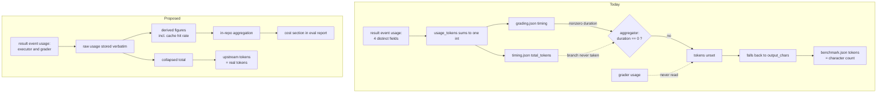

# Eval Cost Ledger - Plan

## Goal Capsule

- **Objective:** Make the behavioural eval tier's token and cache cost observable per run, so a caching change can be shown to have worked or failed.
- **Product authority:** This plan owns the per-run cost record and its readout. Seeding the committed baseline, the cost-regression alarm, and any cost-per-assertion denominator are separate work and are not active scope.
- **Open blockers:** None. Everything remaining is answerable during planning.

---

## Product Contract

### Summary

Record what the model API actually reported for every eval run — executor and grader separately, raw — then aggregate and render it so cache hit rate is readable at a glance. Correct the upstream `tokens` figure, which today reports character counts under a token label.

### Problem Frame

The behavioural eval tier is the expensive one. It runs nightly against a real API key, roughly 24 executions plus 24 grading passes, and it is the only tier that can answer whether the plugin changes model behaviour.

It cannot currently answer anything about its own cost. `usage_tokens()` reads all four usage fields off the result event and sums them into a single integer before anything is persisted. Cache reads and cache writes are added to each other at the point of capture, so the ratio between them — the one number that says whether caching is working — is not merely unreported. It is unrecoverable from the stored artifacts, including retroactively from CI's retained runs. The grader is a second full model call per graded eval, and its usage is never read at all, so roughly half the spend is invisible even in principle.

The figure that does reach `evals/benchmark.json` is worse than coarse. The upstream aggregator reads run duration from `grading.json`, and only falls back to `timing.json` — the one place the token count lives — when that duration is zero. The runner always writes a nonzero duration, so the fallback never fires, `tokens` is never assigned from a token count, and a later guard fills it from `output_chars`. The column labelled tokens holds a transcript character count.

The defect is local, not upstream. The aggregator documents `output_chars` as a deliberate proxy for tokens, to be used when no real usage data exists — a reasonable fallback for callers that have none. This repo does have real usage data and computes it correctly; its plumbing simply never delivers that number into the branch that would consume it, so the proxy wins by default. Any fix framed as correcting an upstream mistake is arguing with a deliberate design.

Nobody has been misled yet only because the committed baseline is still all-null. The mislabelled figure already travels further than the baseline, though: it is uploaded as a workflow artifact and rendered into the GitHub Step Summary that humans read after each nightly.

That aggregator is not this repo's code. It is fetched during the workflow at a pinned commit from an external repository, so it cannot be edited here — only replaced by bumping the pin, or corrected after it runs.

### Key Decisions

- KD1. **Own the cost path in this repo, and correct the upstream scalar in passing.** The aggregator is third-party and carries one number, so five figures cannot survive it; leaving its number wrong would mislead anyone reading `benchmark.json`. (session-settled: user-directed — chosen over routing cost through the aggregator, or correcting it only: the first cannot carry the data, the second caps the work at one scalar.) Governs R9, R10, R11, R12.
- KD2. **Store the usage object as reported, and derive named figures from it.** A fixed field list silently drops anything the API adds — the same class of loss this plan exists to fix. (session-settled: user-directed — chosen over five fixed named fields: Anthropic's 1-hour cache tier already reports a nested breakdown a flat list would discard.) Governs R1, R3.
- KD3. **Cost gets its own per-run record and its own aggregation, rather than riding existing artifacts.** Keeps the expensive-to-rebuild raw record durable and leaves the report's failure surface unchanged. (session-settled: user-directed — chosen over teaching the report to walk the run tree, and over a job-summary-only readout: the first loads risk onto a never-crash guarantee, the second drops cross-run comparability.) Governs R1, R5, R6.
- KD4. **Cache hit rate is a headline figure, not a derivation left to the reader.** It is a ratio within a single run, so it answers the motivating question without the baseline this plan defers. Governs R7.
- KD5. **Executor and grader cost stay separate, never blended.** They are distinct passes that can run different served models, which `grading.json` already records separately. Governs R2, R4, R8.
- KD6. **Cost comes from what the CLI reports, never from a price table kept here.** The result event carries a USD figure and a per-model usage map, so attribution is a field read; maintaining local prices would drift with every pricing change. Governs R3, R4.

### Requirements

**Recording**

- R1. Every eval run records both usage structures the result event reports — the aggregate usage object and the per-model usage map — as reported, with no field dropped, renamed, or summed away.
- R2. The grader pass records its usage alongside the executor's, attributed to the pass that incurred it.
- R3. Named figures — input, output, cache creation, cache read, cache hit rate, and USD cost — are derived from the stored raw record rather than captured in place of it.
- R4. Cost and token figures are attributable to the model that actually served each pass, not only to the pass.
- R5. The per-run cost record leaves the runner — it is included in the graded run's uploaded artifact alongside the per-run grading and transcript files.

**Reporting**

- R6. The eval report carries a cost section covering per-config totals for both passes.
- R7. Cache hit rate appears as a named figure, computed as cache reads over the sum of cache reads and cache creations.
- R8. The cost section reports the delta between the current run and a comparison run when one is supplied, per pass.

**Upstream correction**

- R9. The `tokens` figure reaching `evals/benchmark.json` is a token count, not a character count.
- R10. A run whose token count is legitimately zero reports zero, and never falls back to a character count.
- R11. Every artifact derived from the corrected figure agrees with it — the rendered markdown summary, the uploaded workflow artifact, and the step summary carry the same number as the JSON.

**Consistency and verification**

- R12. The derived figures reconcile with the collapsed total the upstream aggregator reports; the breakdown's components sum to it.
- R13. The offline test suite exercises cache-bearing usage, including a usage object carrying a field the derivation does not recognise.
- R14. The report degrades to a stated absence when cost data is missing or malformed, and never presents an unmeasured value as a measured one.

### Acceptance Examples

- AE1. Measured zero.
  - **Covers R10.**
  - **Given:** an eval run that reported usage, whose token total is genuinely zero.
  - **When:** the run is recorded and aggregated.
  - **Then:** the reported token figure is zero, and no character-derived value appears in its place.
- AE2. Unrecognised usage field.
  - **Covers R1, R13.**
  - **Given:** a result event whose usage object carries a field the derivation has no name for.
  - **When:** the run is recorded.
  - **Then:** the field is present in the stored record, and the derived figures are unaffected.
- AE3. Reconciliation.
  - **Covers R12.**
  - **Given:** a completed run with both passes recorded.
  - **When:** the derived components are summed and compared with the upstream collapsed total.
  - **Then:** they are equal.
- AE4. Missing cost data.
  - **Covers R14.**
  - **Given:** a run tree with no cost record, or one that cannot be parsed.
  - **When:** the report renders.
  - **Then:** the cost section states the absence and the rest of the report renders unchanged.
- AE5. Caching verified from one run.
  - **Covers R7.**
  - **Given:** a single graded run with no comparison run supplied.
  - **When:** the report renders.
  - **Then:** cache hit rate is present and readable without a baseline.
- AE6. Passes served by different models.
  - **Covers R4.**
  - **Given:** a run whose executor and grader were served by different models.
  - **When:** cost is derived.
  - **Then:** each pass's tokens and cost are attributed to the model that served it, and no figure blends the two.
- AE7. Unmeasured usage.
  - **Covers R10, R14.**
  - **Given:** an eval run whose result event carries no usage object, or one that cannot be parsed — an executor that died mid-run, or a CLI whose usage shape changed.
  - **When:** the run is recorded and aggregated.
  - **Then:** the token and cost figures record null rather than zero, the graded run emits a warning naming the run, and no surface presents the absence as a measured value.

### Scope Boundaries

**Deferred for later**

- Seeding `evals/benchmark.json`'s token baseline. It needs a real graded run and this instrumentation to land first.
- A cost or cache-hit regression alarm. The chassis exists three times over in the repo and can be modelled on it once there is a baseline to compare against.
- Reporting cost against a denominator such as tokens per discriminating assertion resolved.

**Outside this plan**

- Forking, vendoring, or patching the upstream aggregator. The correction works with what this repo writes, not by changing code it does not own.
- Any change to what the evals assert, how many runs execute, or which model is pinned.
- Enabling prompt caching itself. This plan makes that change measurable; it does not make it.

<!-- ce-section: work-relationships -->
### How This Work Fits Together

This plan owns one area: recording eval cost and making it readable. The breakdown below is how the surrounding work is currently understood, not a committed roadmap — a later plan may revise, split, merge, or discard any of it.

- Cost ledger and readout — this plan.
  - Baseline seeding — `Depends on` this plan. Needs a real graded run to produce figures worth committing, and those figures must come from the corrected path or the baseline bakes in the current mislabelling.
  - Cost and cache-hit regression alarm — `Depends on` baseline seeding, which gives it something to compare against. `Shares` the alarm chassis already used three times in this repo.
  - Cost per discriminating assertion — `Depends on` this plan for the numerator. `Still to decide` whether the denominator is the right ranking unit at all.
- Prompt caching itself — `Can proceed independently of` this plan technically, but `Depends on` it to be verifiable: without the ledger, a caching change produces no observable difference in any artifact.

The remaining survivors of `docs/ideation/2026-08-17-eval-token-efficiency-ideation.html` — batching the grader, content-addressed run skipping, adaptive repeat counts, stub read-logging — are separate areas that also depend on this one for measurement. Scope Boundaries below remains the authority on what this plan excludes.

### Dependencies and Assumptions

- The upstream aggregator is fetched during the workflow at a pinned commit, so its behaviour cannot drift on its own. It changes only when someone bumps the pin, and a bump is the moment to re-check R9 through R12.
- The aggregated JSON is not the only derived surface. A rendered markdown summary is produced from the same data during the workflow, so correcting one without the other leaves two artifacts disagreeing — this is what R11 exists to prevent.
- The CLI is installed unpinned on every graded run, and the USD figure comes from that CLI's own pricing and usage schema. Unlike the aggregator, nothing triggers a re-check when it changes.
- The per-run token total the runner already computes is correct. Nothing in this plan depends on recomputing it; the work is delivering it somewhere it survives.
- Real usage data appears only in the nightly graded tier. Per-PR CI stays offline and makes no API calls, so every requirement here is verified offline against synthetic usage.
- The result event carries a USD cost figure and a per-model usage map, verified against the installed CLI's own result-event schema. Cost is therefore a field read, not a computation, and this repo keeps no price table.

### Outstanding Questions

**Deferred to planning**

- Q1. Where the per-run cost record lives and how its aggregation is wired.
- Q2. Where in the workflow the recomputation lands. The correction recomputes the token statistics in this repo after the aggregator runs and overwrites them before the derived markdown is rendered; the workflow already post-processes aggregated output this way for other fields, so the shape has a working precedent here. Changing the aggregator itself is not a candidate — Scope Boundaries places it outside this plan. Note that the run-level metadata file carries no token data, so the correction walks the run tree itself.
- Q3. Whether the comparison run in R8 is supplied by path or discovered.

### Sources

- `scripts/run-behavioural-eval.py` — `usage_tokens()` and its four-field sum; the timing dict written to both `timing.json` and `grading.json`; the grader pass whose parsed payload is used for model identity but never for usage; `models.requested` / `executor` / `analyzer`.
- `scripts/eval-report.py` — the never-crash contract and the four failure modes it names; renders pass rate only.
- `evals/benchmark.json` — the null token block and its self-documented unmeasured state.
- `scripts/run-behavioural-eval.test.sh` — the offline fake model, whose usage object carries only input and output tokens.
- `.github/workflows/skills-eval.yml` — fetches the aggregator at a pinned commit, already post-processes the aggregated output and re-renders its markdown, uploads the result as an artifact, and feeds the step-summary delta report.
- `scripts/grounding-fire-rate-check.sh`, `scripts/plugin-version-skew-check.sh`, `scripts/release-pr-age-check.sh` — the shared alarm chassis a later regression check would follow.
- `docs/adr/0012-test-the-skills-not-just-the-scaffolding.md`, `docs/adr/0014-eval-hermeticity-by-config-dir-isolation-not-bare.md` — the tier model and the hermeticity and model-pinning constraints this instrumentation runs inside.
- `docs/ideation/2026-08-17-eval-token-efficiency-ideation.html` — the ranked ideation this plan is the first survivor of.
