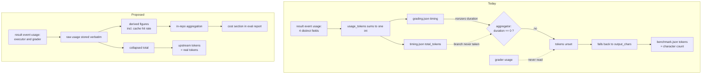

# Eval Cost Ledger - Plan

## Goal Capsule

- **Objective:** Make the behavioural eval tier's token and cache cost observable per run, so a caching change can be shown to have worked or failed.
- **Product authority:** This plan owns the per-run cost record and its readout. Seeding the committed baseline, the cost-regression alarm, and any cost-per-assertion denominator are separate work and are not active scope.
- **Open blockers:** None. Everything remaining is answerable during planning.

---

## Product Contract

### Summary

Record what the model API actually reported for every eval run — executor and grader separately, raw — then aggregate and render it so cache hit rate is readable at a glance. Correct the upstream `tokens` figure, which today reports character counts under a token label.

### Problem Frame

The behavioural eval tier is the expensive one. It runs nightly against a real API key, roughly 24 executions plus 24 grading passes, and it is the only tier that can answer whether the plugin changes model behaviour.

It cannot currently answer anything about its own cost. `usage_tokens()` reads all four usage fields off the result event and sums them into a single integer before anything is persisted. Cache reads and cache writes are added to each other at the point of capture, so the ratio between them — the one number that says whether caching is working — is not merely unreported. It is unrecoverable from the stored artifacts, including retroactively from CI's retained runs. The grader is a second full model call per graded eval, and its usage is never read at all, so roughly half the spend is invisible even in principle.

The figure that does reach `evals/benchmark.json` is worse than coarse. The upstream aggregator reads run duration from `grading.json`, and only falls back to `timing.json` — the one place the token count lives — when that duration is zero. The runner always writes a nonzero duration, so the fallback never fires, `tokens` is never assigned from a token count, and a later guard fills it from `output_chars`. The column labelled tokens holds a transcript character count.

The defect is local, not upstream. The aggregator documents `output_chars` as a deliberate proxy for tokens, to be used when no real usage data exists — a reasonable fallback for callers that have none. This repo does have real usage data and computes it correctly; its plumbing simply never delivers that number into the branch that would consume it, so the proxy wins by default. Any fix framed as correcting an upstream mistake is arguing with a deliberate design.

Nobody has been misled yet only because the committed baseline is still all-null. The mislabelled figure already travels further than the baseline, though: it is uploaded as a workflow artifact and rendered into the GitHub Step Summary that humans read after each nightly.

That aggregator is not this repo's code. It is fetched during the workflow at a pinned commit from an external repository, so it cannot be edited here — only replaced by bumping the pin, or corrected after it runs.



### Key Decisions

- KD1. **Own the cost path in this repo, and correct the upstream scalar in passing.** The aggregator is third-party and carries a single token figure per run, so five figures cannot survive it; leaving its number wrong would mislead anyone reading `benchmark.json`. (session-settled: user-directed — chosen over routing cost through the aggregator, or correcting it only: the first cannot carry the data, the second caps the work at one scalar.) Governs R10, R11, R12, R13, R14.
  - *Planning correction:* that single per-run figure is written to **three** places in the aggregator's output, at two different shapes — `run_summary[<config>].tokens` as a `{mean, stddev, min, max}` block, `run_summary.delta.tokens` as a preformatted `f"{x:+.0f}"` **string**, and `runs[].result.tokens` as a per-run integer. The decision is unchanged; the correction's surface area is three writes, not one.
- KD2. **Store the usage object as reported, and derive named figures from it.** A fixed field list silently drops anything the API adds — the same class of loss this plan exists to fix. (session-settled: user-directed — chosen over five fixed named fields: Anthropic's 1-hour cache tier already reports a nested breakdown a flat list would discard.) Governs R1, R3.
- KD3. **Cost gets its own per-run record and its own aggregation, rather than riding existing artifacts.** Keeps the expensive-to-rebuild raw record durable and leaves the report's failure surface unchanged. (session-settled: user-directed — chosen over teaching the report to walk the run tree, and over a job-summary-only readout: the first loads risk onto a never-crash guarantee, the second drops cross-run comparability.) Governs R1, R5, R7.
- KD4. **Cache hit rate is a headline figure, not a derivation left to the reader.** It is a ratio within a single run, so it answers the motivating question without the baseline this plan defers. Governs R8.
- KD5. **Executor and grader cost stay separate, never blended.** They are distinct passes that can run different served models, which `grading.json` already records separately. Governs R2, R4, R9.
- KD6. **Cost comes from what the CLI reports, never from a price table kept here.** The result event carries a USD figure and a per-model usage map, so attribution is a field read; maintaining local prices would drift with every pricing change. Governs R3, R4, R6.

### Requirements

**Recording**

- R1. Every eval run records both usage structures the result event reports — the aggregate usage object and the per-model usage map — as reported, with no field dropped, renamed, or summed away.
- R2. The grader pass records its usage alongside the executor's, attributed to the pass that incurred it.
- R2a. Each pass records its own terminal state, distinguishing a pass that was never invoked (no cost incurred) from one that was invoked and failed (cost incurred, usage unrecoverable) from one that succeeded. *(Added at planning — see Product Contract Amendments.)*
- R3. Named figures — input, output, cache creation, cache read, cache hit rate, and USD cost — are derived from the stored raw record rather than captured in place of it. The derivation sums a named set of token fields; a field outside that set is stored but never summed.
- R4. Cost and token figures are attributable to the model that actually served each pass. Attribution is a per-model map, not a single model name per pass, because one pass can be served by more than one model.
- R5. The per-run cost record leaves the runner — it is included in the graded run's uploaded artifact alongside the per-run grading and transcript files.
- R6. The per-run cost record names the CLI version that produced its figures, so a cost comparison can be scoped to a single CLI.

**Reporting**

- R7. The eval report carries a cost section covering per-config totals for both passes.
- R8. Cache hit rate appears as a named figure, computed as cache reads over the sum of cache reads and cache creations.
- R9. The cost section reports the delta between the current run and a comparison run when one is supplied, per pass.

**Upstream correction**

- R10. The `tokens` figure reaching `evals/benchmark.json` is a token count covering the executor and grader passes summed, over the named token fields R3 defines.
- R11. A run whose token count is legitimately zero reports zero, and never falls back to a character count.
- R12. Every artifact derived from the corrected figure agrees with it — the rendered markdown summary, the intermediate copy the step summary is rendered from, the uploaded workflow artifact, and the step summary itself carry the same number as the JSON. This holds for all three places the figure is written, including the per-run array.
- R13. The correction is unconditional and idempotent — it recomputes the figure from the run tree every time, and emits a warning naming the run when the recomputed value disagrees with the aggregator's beyond rounding. *(Amended at planning — see Product Contract Amendments.)*

**Consistency and verification**

- R14. The derived figures reconcile with the corrected figure as R10 defines it; the breakdown's components sum to it.
- R15. The offline test suite exercises the shapes the derivation must survive: cache-bearing usage, an unrecognised scalar field, an unrecognised nested object, a non-numeric field, a grader that was never invoked, a grader that was invoked and failed, and a result event carrying no usage at all.
- R16. The report degrades to a stated absence when cost data is missing, malformed, or structurally unexpected, and never presents an unmeasured value as a measured one. The cost section's failure degrades only the cost section; the rest of the report renders unchanged.
- R17. Each eval is identified by a key unique across the whole run, so a corrected figure can be joined back to the run that produced it. *(Added at planning — see Product Contract Amendments.)*

### Acceptance Examples

- AE1. Measured zero.
  - **Covers R11.**
  - **Given:** an eval run that reported usage, whose token total is genuinely zero.
  - **When:** the run is recorded and aggregated.
  - **Then:** the reported token figure is zero, and no character-derived value appears in its place.
- AE2. Unrecognised scalar field.
  - **Covers R1, R3, R15.**
  - **Given:** a result event whose usage object carries an integer field the derivation has no name for.
  - **When:** the run is recorded and the figures derived.
  - **Then:** the field is present verbatim in the stored record, and no derived figure includes it.
- AE2a. Unrecognised nested breakdown.
  - **Covers R1, R3, R15.**
  - **Given:** a usage object carrying a nested `cache_creation` breakdown alongside the flat `cache_creation_input_tokens` it decomposes — the shape the 1-hour cache tier reports.
  - **When:** the run is recorded and the figures derived.
  - **Then:** the nested object is stored verbatim, and cache creation is counted once, from the flat field only. The hit-rate denominator is unchanged by the presence of the breakdown.
- AE2b. Non-numeric usage field.
  - **Covers R3, R15.**
  - **Given:** a usage object carrying a string-valued field such as `service_tier`.
  - **When:** the figures are derived.
  - **Then:** the derivation completes, the field is stored verbatim, and no arithmetic is attempted on it.
- AE3. Reconciliation.
  - **Covers R10, R14.**
  - **Given:** a completed run with both passes recorded.
  - **When:** the derived components are summed and compared with the corrected figure over the same passes and fields R10 defines.
  - **Then:** they are equal.
- AE4. Missing cost data.
  - **Covers R16.**
  - **Given:** a run tree with no cost record, or one that cannot be parsed.
  - **When:** the report renders.
  - **Then:** the cost section states the absence and the rest of the report renders unchanged.
- AE5. Caching verified from one run.
  - **Covers R7, R8.**
  - **Given:** a single graded run with no comparison run supplied.
  - **When:** the report renders.
  - **Then:** cache hit rate is present and readable without a baseline.
- AE6. Passes served by different models.
  - **Covers R2, R4.**
  - **Given:** a run whose executor and grader were served by different models, and whose executor pass carries two entries in its per-model map — a subagent turn served by a second model.
  - **When:** cost is derived.
  - **Then:** every entry's tokens and cost are attributed to the model that served it, both executor entries are preserved rather than collapsed to the first, and no figure blends passes.
- AE7. Unmeasured usage.
  - **Covers R11, R16.**
  - **Given:** an eval run whose result event carries no usage object, or one that cannot be parsed — an executor that died mid-run, or a CLI whose usage shape changed.
  - **When:** the run is recorded and aggregated.
  - **Then:** the token and cost figures record null rather than zero, the graded run emits a warning naming the run, and no surface presents the absence as a measured value.
- AE8. Upstream figure already correct.
  - **Covers R13.**
  - **Given:** an aggregator, at a newly bumped pin, that already reports the same token count the run tree yields.
  - **When:** the correction runs.
  - **Then:** the written figure is unchanged, no warning is emitted, and running the correction a second time changes nothing.
- AE9. Grader never invoked versus grader billed and failed.
  - **Covers R2a, R15.**
  - **Given:** two runs — one whose case carries no judged assertions, so no grader ran; one whose grader was invoked and then died before returning a parseable payload.
  - **When:** both are recorded and aggregated.
  - **Then:** the first records a grader state of not-invoked with a structural zero cost; the second records a state of failed with cost unknown-but-incurred. Neither is reported as the other, and the aggregate does not present the second as zero spend.
- AE10. The two usage sources agree.
  - **Covers R1, R14.**
  - **Given:** a multi-turn run whose result event carries both an aggregate usage object and a per-model usage map.
  - **When:** the per-model map's token counts are summed and compared with the aggregate object.
  - **Then:** they agree; a disagreement emits a warning naming the run rather than silently preferring one.
- AE11. Corrected figure joins back to its run.
  - **Covers R12, R17.**
  - **Given:** a run tree containing two suites that each number their first eval zero.
  - **When:** the correction writes per-run token counts back into the aggregated output.
  - **Then:** each run's figure lands on that run's entry, and no entry receives another suite's figure.
- AE12. Comparison run supplied.
  - **Covers R9.**
  - **Given:** a rendered report with a comparison run supplied by path.
  - **When:** the cost section renders.
  - **Then:** the delta against that run appears per pass, executor and grader separately, and a config the comparison has never seen reports an absence rather than a delta against nothing.
- AE13. CLI version on the record.
  - **Covers R6.**
  - **Given:** a completed eval run.
  - **When:** its cost record is read.
  - **Then:** the record names the CLI version that produced its figures, so a cost comparison spanning a CLI upgrade can be scoped or discarded.

### Product Contract Amendments

Planning preserved every Product Contract decision. Five items changed wording, and two were added, because the contract as written could not be satisfied as written. Each is recorded here rather than silently edited.

- **R10 vs AE2 were contradictory.** R10 summed "every usage field the result event reports"; AE2 required an unrecognised field to leave derived figures unaffected. The R10 total *is* a derived figure, so exactly one could hold. Resolved by scoping KD2 to storage and giving derivation a named field set: R1 still stores verbatim, R3 and R10 now sum a named set. Verified as load-bearing, not hypothetical — the live usage object carries `service_tier` as a string, and the 1-hour cache tier reports a nested `cache_creation` breakdown alongside the flat field it decomposes, so a literal "every field" sum would raise on the first and double-count the second, corrupting R8's hit-rate denominator.
- **R13 vs R14 were contradictory, and R13's predicate was unobservable.** A token count and a character count are both integers with nothing distinguishing them, so AE8 named a condition no code could test. And an upstream figure that was correct but executor-only would be left alone by R13 while R14 demanded it reconcile with an executor-plus-grader breakdown. Resolved by making the correction unconditional and warning on disagreement — idempotent, satisfies R14 in every case, and turns AE8 into an assertion that the warning stays silent.
- **R12 named three derived surfaces; there are four.** `benchmark-current.json` is copied at the end of the aggregate step and is what the step summary renders from. A correction landing in a new step after aggregation — the most natural implementation — would fix the JSON and leave the markdown and step summary carrying character counts, which is the disagreement R12 exists to prevent.
- **R4 assumed one model per pass.** The per-model usage map can carry several entries for one pass: the eval tool set deliberately offers `Task`, whose subagent turns can be served by a different model, and cache-tier-suffixed names key as separate entries for what is one model.
- **R15 was scoped as one fixture change.** It is at minimum seven shapes, enumerated in the amended text.
- **R2a is new.** The grader has three terminal states, not two, and the two that were collapsed differ in the only way a cost ledger cares about: a grader that was never invoked cost nothing, while a grader that timed out at 900 seconds was billed in full. Recording both as a null under-reports spend on exactly the runs that wasted it.
- **R17 is new.** It carries the scope decision below.

**Scope decisions taken at planning** (both expand the work beyond the requirements-only plan, and both were confirmed):

- **Suite-qualify the eval identifier** rather than carving the per-run array out of R12. `runs[]` entries are keyed by `eval_id`, `configuration`, `run_number` with no suite qualifier, and eval ids are unique only within a case file — the committed baseline shows two suites both numbering an eval zero. Without R17 the per-run figures cannot be joined back to their runs and R12 needs a written exception. The runner's own docstring already explains why the *directory* name is suite-qualified; the metadata field simply never followed.
- **Verify the correction on every PR** against the real pinned aggregator, rather than nightly-only against a shape fixture. The objection to this was that it makes the per-PR gate network-dependent — but that gate already downloads shellcheck from a GitHub release URL, pinned by version and digest, with a post-extraction identity assertion. A digest-pinned aggregator fetch is the posture already in use, so ADR-0012's description of the tier as "deterministic, offline, and sub-second" is corrected to match what it has been doing rather than reversed.

### Scope Boundaries

**Deferred for later**

- Seeding `evals/benchmark.json`'s token baseline. It needs a real graded run and this instrumentation to land first.
- A cost or cache-hit regression alarm. The chassis exists three times over in the repo and can be modelled on it once there is a baseline to compare against.
- Reporting cost against a denominator such as tokens per discriminating assertion resolved.

**Outside this plan**

- Forking, vendoring, or patching the upstream aggregator. The correction works with what this repo writes, not by changing code it does not own.
- Any change to what the evals assert, how many runs execute, or which model is pinned.
- Enabling prompt caching itself. This plan makes that change measurable; it does not make it.

<!-- ce-section: work-relationships -->
### How This Work Fits Together

This plan owns one area: recording eval cost and making it readable. The breakdown below is how the surrounding work is currently understood, not a committed roadmap — a later plan may revise, split, merge, or discard any of it.

- Cost ledger and readout — this plan.
  - Baseline seeding — `Depends on` this plan. Needs a real graded run to produce figures worth committing, and those figures must come from the corrected path or the baseline bakes in the current mislabelling.
  - Cost and cache-hit regression alarm — `Depends on` baseline seeding, which gives it something to compare against. `Shares` the alarm chassis already used three times in this repo.
  - Cost per discriminating assertion — `Depends on` this plan for the numerator. `Still to decide` whether the denominator is the right ranking unit at all.
- Prompt caching itself — `Can proceed independently of` this plan technically, but `Depends on` it to be verifiable: without the ledger, a caching change produces no observable difference in any artifact.

The remaining survivors of `docs/ideation/2026-08-17-eval-token-efficiency-ideation.html` — batching the grader, content-addressed run skipping, adaptive repeat counts, stub read-logging — are separate areas that also depend on this one for measurement. Scope Boundaries below remains the authority on what this plan excludes.

### Dependencies and Assumptions

- The upstream aggregator is fetched during the workflow at a pinned commit, so its behaviour cannot drift on its own. It changes only when someone bumps the pin, and a bump is the moment to re-check R10 through R14.
- The aggregated JSON is not the only derived surface. A rendered markdown summary is produced from the same data during the workflow, so correcting one without the other leaves two artifacts disagreeing — this is what R12 exists to prevent.
- The CLI is installed unpinned on every graded run, and the USD figure comes from that CLI's own pricing and usage schema. Unlike the aggregator, nothing triggers a re-check when it changes, which is why R6 stamps the version onto the record.
- The per-run token total the runner computes today is correct for the executor pass but covers only that pass. R10 widens it to include the grader rather than delivering it unchanged, so the reconciliation in R14 compares like with like.
- Real usage data appears only in the nightly graded tier, and per-PR CI makes no API calls. R1 through R9 and R15 through R17 are verified offline against synthetic usage.
- R10 through R14 are verified per PR by fetching the pinned aggregator and running it over a synthetic run tree, then correcting the result. That needs network but no API key. The comparison to the stub does **not** hold — the stub is local, this is a fetch from an external repository — but the comparison that does hold is `scripts-test.yml`'s existing shellcheck download: an external GitHub URL pinned by version and SHA256, digest-checked and identity-asserted before use. The aggregator pin is already a commit SHA, which is the same guarantee.
- The aggregator pin now has two consumers, so it needs one source. Duplicating the SHA across two workflows is a drift hazard of exactly the kind this repo pins things to avoid.
- The aggregator reads `eval_id` from `eval_metadata.json` verbatim and never coerces it to an integer, so suite-qualifying it is a change at the runner's write site alone. One consequence to watch: the aggregator falls back to an integer index when a metadata file is missing, and a tree mixing integer and string ids would raise on its `sorted()`. The runner writes the metadata file at eval-directory creation, before any run directory exists, so a tree with runs but no metadata is not a state the runner produces.
- `evals/benchmark.json` carries a hand-authored `cases` block whose entries will no longer match the qualified ids. It is not hand-edited here: CLAUDE.md requires the baseline be seeded from a real `workflow_dispatch` run, and it is still unmeasured. The mismatch resolves when it is seeded.
- The result event carries a USD cost figure and a per-model usage map, verified against the installed CLI's own result-event schema. Cost is therefore a field read, not a computation, and this repo keeps no price table.

### Outstanding Questions

**Resolved during planning**

- Q1. *Where the per-run cost record lives and how its aggregation is wired.* — `<run_dir>/cost.json`, written by `run_once()` alongside `timing.json`, which already holds both halves: the executor's event stream and the grader's parsed payload. Aggregation is a separate script walking `eval-*/<config>/run-*/cost.json` into `<out>/cost-summary.json`; the report reads that summary by path and never walks the tree. See T1 and T2.
- Q2. *Where in the workflow the recomputation lands.* — Inside the existing `Aggregate` step, between the aggregator invocation and the metadata heredoc. That heredoc already re-renders `benchmark.md` through the aggregator's own function, and the step ends by copying the JSON to `benchmark-current.json`, so a correction placed before it reaches all four derived surfaces with no second render. See T3.
- Q3. *Whether the comparison run in R9 is supplied by path or discovered.* — Supplied by path, unset by default. See T4.

**Deferred to implementation**

- Whether the aggregate cost record is worth committing as a baseline is out of scope here; Scope Boundaries defers baseline seeding, and R9's comparison run reads whatever path it is given.

### Sources

- `scripts/run-behavioural-eval.py` — `usage_tokens()` and its four-field sum; the timing dict written to both `timing.json` and `grading.json`; the grader pass whose parsed payload is used for model identity but never for usage; `models.requested` / `executor` / `analyzer`.
- `scripts/eval-report.py` — the never-crash contract and the four failure modes it names; renders pass rate only.
- `evals/benchmark.json` — the null token block and its self-documented unmeasured state.
- `scripts/run-behavioural-eval.test.sh` — the offline fake model, whose usage object carries only input and output tokens.
- `.github/workflows/skills-eval.yml` — fetches the aggregator at a pinned commit, already post-processes the aggregated output and re-renders its markdown, uploads the result as an artifact, and feeds the step-summary delta report.
- `scripts/grounding-fire-rate-check.sh`, `scripts/plugin-version-skew-check.sh`, `scripts/release-pr-age-check.sh` — the shared alarm chassis a later regression check would follow.
- `docs/adr/0012-test-the-skills-not-just-the-scaffolding.md`, `docs/adr/0014-eval-hermeticity-by-config-dir-isolation-not-bare.md` — the tier model and the hermeticity and model-pinning constraints this instrumentation runs inside.
- `docs/ideation/2026-08-17-eval-token-efficiency-ideation.html` — the ranked ideation this plan is the first survivor of.

---

## Planning Contract

### Key Technical Decisions

- T1. **The per-run record stores raw usage only; every named figure is derived downstream.** Keeping `cost.json` free of derived values makes AE2, AE2a, and AE2b true by construction rather than by care — an unrecognised field cannot corrupt a figure that is not in the file. It also means a derivation-rule change is re-runnable over retained artifacts instead of requiring a fresh paid run. Governs R1, R3.
- T2. **Derivation and aggregation live in one new standalone script, `scripts/eval-cost.py`, with two modes.** The repo's Python scripts are each fully standalone with no shared module, and this one has two callers in the same workflow step. One file with `aggregate` and `correct` modes keeps the derivation rule in a single place, which is what makes R14's reconciliation an identity rather than an agreement between two implementations. Governs R3, R10, R14.
- T3. **The correction runs inside the existing `Aggregate` step, between the aggregator invocation and the metadata heredoc.** The heredoc already re-renders `benchmark.md` through `agg.generate_markdown(data)`, and the step's final line copies the JSON to `benchmark-current.json`. Landing before both gives all four derived surfaces the corrected figure with no second render and no possibility of drift. The alternative — a new step after `Aggregate` — is the natural implementation and silently violates R12 on two of four surfaces. Governs R12.
- T4. **The comparison run is supplied by an explicit path, absent by default.** `eval-report.py` already takes explicit `--current` and `--baseline`; there is no committed cost baseline to discover, since Scope Boundaries defers seeding; and discovery heuristics inside a script whose contract is "never crash" add a failure mode to the one place that must not have one. Absent flag means no delta column, which AE5 already requires to work. Governs R9.
- T5. **The aggregator pin gets one source of truth, `evals/aggregator-pin.txt`, read by both workflows.** The SHA acquires a second consumer in this change. Two copies of a pin drift, and a drifted pin is invisible until the two jobs disagree — the failure mode pinning exists to remove. Governs R10 through R14.
- T6. **The cost section renders in structural isolation from the rest of the report.** Its own render function, its own failure boundary, degrading to a stated absence without touching the pass-rate table. #199 was not a missing file or malformed JSON — it was a well-formed file with an unanticipated type meeting `.get("mean")`, and because the step is `continue-on-error: true`, a repeat would turn the paid run's headline number yellow and silent. R16's "malformed" is not enough on its own; the isolation is what makes it hold against a shape nobody predicted. Governs R16.
- T7. **`usage` is authoritative for token totals; the per-model map is authoritative for attribution and USD.** Today's figure comes from `usage`, and R10 widens that same figure to include the grader, so R14 compares like with like. The map is what R4 needs and is where `costUSD` lives per model. They are computed differently upstream and can disagree, so AE10 asserts agreement and warns rather than letting one silently win. Governs R4, R10, R14.

### Implementation Units

**U1. Suite-qualify the eval identifier**

- **Goal:** make each eval's identifier unique across the whole run, so a corrected per-run figure can be joined back to the run that produced it (R17).
- **Files:** `scripts/run-behavioural-eval.py` (modify — the `eval_metadata.json` write site, ~line 1017), `scripts/run-behavioural-eval.test.sh` (modify).
- **Approach:** write the already-computed `suite` alongside the raw id, and set the metadata's `eval_id` to the qualified form the run directory already uses. The aggregator reads this field verbatim and never coerces it, so nothing downstream needs changing to accept it. Leave `evals/benchmark.json`'s hand-authored `cases` block alone — it is re-seeded from a real run, not hand-edited.
- **Test scenarios:** two case files whose first evals both use id zero produce two distinct metadata ids; the run-directory name and the metadata id agree; a tree with an eval directory but no metadata file still aggregates (the integer-index fallback path).
- **Verification:** `bash scripts/run-behavioural-eval.test.sh`.

**U2. Record raw per-pass usage**

- **Goal:** persist both usage structures for both passes, verbatim, with each pass's terminal state (R1, R2, R2a, R6).
- **Files:** `scripts/run-behavioural-eval.py` (modify — `run_once()`, `grade_judged()`), `scripts/run-behavioural-eval.test.sh` (modify).
- **Approach:** `grade_judged()` currently reads the parsed payload for model identity and discards the rest; return its usage alongside what it already returns. `run_once()` writes `<run_dir>/cost.json` next to `timing.json`, carrying a schema version, the CLI version, and one entry per pass holding `status`, the aggregate usage object, and the per-model map — all copied without renaming, filtering, or summing. Status is `ok`, `failed`, or `not_invoked`; the third covers a case with no judged assertions, `--no-grade`, and an executor error that stopped the grader from running. Capture the CLI version once per process rather than per run.
- **Test scenarios:** cache-bearing usage on both passes; an unrecognised scalar field; a nested `cache_creation` breakdown; a non-numeric `service_tier`; a grader that dies (the existing `FAKE_GRADER_DIE` lever); a case with no judged assertions, which the suite's primary case already exhibits; an executor error; a result event with no usage key at all; the fake model answering `--version`.
- **Verification:** `bash scripts/run-behavioural-eval.test.sh`.
- **Note:** the fake `claude` has no `--version` branch today and would fall through to plan-replay. Teaching it to answer is part of this unit, not a follow-up.

**U3. Derive and aggregate**

- **Goal:** turn the raw records into named figures and a run-level summary (R3, R4, R7, R8).
- **Files:** `scripts/eval-cost.py` (new), `scripts/eval-cost.test.sh` (new).
- **Approach:** `aggregate` mode walks `eval-*/<config>/run-*/cost.json` and writes `<out>/cost-summary.json`. The derivation sums a named field set; a value outside it is ignored, whether it is unrecognised, nested, or non-numeric. Cache creation is counted from the flat field only, so a nested breakdown cannot double-count it. Cache hit rate is cache reads over cache reads plus cache creations, guarded against a zero denominator. USD is read, never computed. Attribution is per model per pass. A pass with status `failed` contributes cost-unknown-but-incurred, distinct from a `not_invoked` structural zero.
- **Test scenarios:** hit rate on a cache-bearing fixture; hit rate with a zero denominator; nested breakdown counted once; non-numeric field survived; the two grader states aggregating differently; a per-model map with two entries for one pass; `usage` and per-model map disagreeing, emitting a warning; a run tree with no cost records at all.
- **Verification:** `bash scripts/eval-cost.test.sh`.

**U4. Correct the aggregated benchmark**

- **Goal:** replace the character count with a token count everywhere the aggregator writes it (R10, R11, R12, R13, R14).
- **Files:** `scripts/eval-cost.py` (modify — `correct` mode), `scripts/eval-cost.test.sh` (modify).
- **Approach:** recompute unconditionally from `cost-summary.json` and rewrite all three sites — the per-config `{mean, stddev, min, max}` block, the `delta` string preserving its `f"{x:+.0f}"` format exactly, and each per-run integer joined on the qualified id from U1. Emit a warning naming the run when the recomputed value disagrees with the aggregator's beyond rounding. Idempotent by construction: a second run recomputes the same value from the same source.
- **Test scenarios:** a genuine zero survives as zero rather than becoming `output_chars`; the delta keeps its sign-and-format string; running twice changes nothing; an already-correct upstream figure produces no warning; a disagreement produces one; two suites each numbering an eval zero join correctly; the reconciliation in AE3 holds between the breakdown and the corrected figure.
- **Verification:** `bash scripts/eval-cost.test.sh`.
- **Note:** the aggregator's `if not result.get("tokens")` is a truthiness test, so a genuine zero falls through to `output_chars` no matter what the runner writes. Making the upstream fallback fire is not an available shortcut — the correction is structurally required.

**U5. Cost section in the report**

- **Goal:** render cost per config for both passes, with hit rate and an optional delta (R7, R8, R9, R16).
- **Files:** `scripts/eval-report.py` (modify), `scripts/eval-report.test.sh` (modify).
- **Approach:** add `--cost` and an optional `--cost-baseline`, both plain paths. Render the cost section from its own function behind its own failure boundary, so any failure inside it degrades to a stated absence and leaves the pass-rate table intact. Reuse the existing `.get(config)` → `n/a` pattern for a config the comparison has never seen.
- **Test scenarios:** the four shapes already in the suite's contract, each with cost present and absent; a cost summary that parses but carries an unexpected shape — a null where a mapping was expected, an empty per-model map, an unknown status value — degrading to an absence without touching the rest; no `--cost-baseline` supplied, so hit rate renders and no delta column appears; a comparison whose config set differs from the current run's.
- **Verification:** `bash scripts/eval-report.test.sh`.

**U6. Wire the graded workflow**

- **Goal:** run aggregation and correction in the right place, and ship the new records (R5, R12).
- **Files:** `.github/workflows/skills-eval.yml` (modify).
- **Approach:** inside the `Aggregate` step, after `python3 "$AGGREGATOR" …` and before the metadata heredoc, run `eval-cost.py aggregate` then `eval-cost.py correct`. The heredoc's existing `generate_markdown` re-render and the step's closing `cp` to `benchmark-current.json` then both carry corrected data. Add `**/cost.json` and `cost-summary.json` to the upload globs, which today enumerate exactly four paths. Pass `--cost` to the report invocation.
- **Test scenarios:** not directly unit-testable — this is workflow wiring. It is covered indirectly: U4's suite proves the correction over a real aggregator run, and the ordering claim is verified by reading the step, not by executing it.
- **Verification:** `bash scripts/test-wiring-check.sh`; the step's own `set -euo pipefail`.
- **Note:** `if-no-files-found: warn` means a missing cost record would ship a green run with no cost artifact. The glob addition is what makes R5 real; nothing else fails if it is forgotten.

**U7. Verify the correction per PR**

- **Goal:** prove R10 through R14 against the real pinned aggregator on every PR, not on a paid nightly (R15).
- **Files:** `evals/aggregator-pin.txt` (new), `.github/workflows/scripts-test.yml` (modify), `.github/workflows/skills-eval.yml` (modify), `scripts/eval-cost.test.sh` (modify), `docs/adr/0012-test-the-skills-not-just-the-scaffolding.md` (modify).
- **Approach:** move the pin into a file both workflows read, so the two consumers cannot drift. Add a sparse-checkout fetch to `scripts-test.yml` mirroring the graded job's, asserting `rev-parse HEAD` against the pin before use. `eval-cost.test.sh` uses `$AGGREGATOR` when the environment provides it and falls back to a committed shape fixture otherwise, so a local `bash scripts/eval-cost.test.sh` still runs without network. Amend ADR-0012's description of the per-PR tier as "deterministic, offline, and sub-second" to match what it already does — the shellcheck download predates this change.
- **Test scenarios:** the pin file and both workflows agree; the suite passes with `AGGREGATOR` set and with it unset; a fetched aggregator whose SHA does not match the pin fails the step.
- **Verification:** `bash scripts/eval-cost.test.sh`; `bash scripts/test-wiring-check.sh`; `bash scripts/skills-lint.sh`.

**Sequencing.** U1 → U2 → U3 → U4, then U5 and U6 in either order, then U7. U1 is first and small because U4's join depends on it. U7 is last because it verifies U4.

### Verification Contract

Run before pushing:

```bash
bash scripts/skills-lint.sh
bash scripts/skills-lint.test.sh
bash scripts/test-wiring-check.sh
bash scripts/run-behavioural-eval.test.sh
bash scripts/eval-report.test.sh
bash scripts/eval-cost.test.sh
shellcheck --severity=style scripts/*.sh   # match the pin in scripts-test.yml
```

Every new defensive check carries a mutation case, per this repo's standing rule: the suite asserts both that a seeded defect fails the check and that it passes with only that check disabled. The second half is what proves the check is load-bearing rather than incidentally covered.

No unit in this plan makes an API call. The graded tier is where real usage appears, and nothing here requires a paid run to be verified — which is the point of U7.

One requirement has no executable acceptance example and is verified by inspection instead: **R5**, the cost record reaching the uploaded artifact, is a property of the workflow's upload globs. `if-no-files-found: warn` means forgetting it produces a green run with a silently missing artifact, so it is called out in U6 rather than left to a test that cannot reach it.

### Definition of Done

- Every run in a graded tree carries a `cost.json` holding both passes' raw usage, their terminal states, and the CLI version.
- `benchmark.json`'s `tokens` figure is a token count at all three sites it is written, and `benchmark.md`, `benchmark-current.json`, the step summary, and the uploaded artifact all agree with it.
- The eval report carries a cost section with cache hit rate readable from a single run, and its failure cannot take the pass-rate table with it.
- The suites above pass, each new check has its mutation case, and `test-wiring-check.sh` finds no unwired suite.
- ADR-0012's per-PR tier description matches what that tier actually does.

### Risks

- **The correction depends on the aggregator's output shape, which is external.** A pin bump can change field names or nesting under the plan's feet. Mitigated by U7 running the real aggregator per PR, so a bump that breaks the correction reddens the PR that bumps it rather than a nightly a week later.
- **`usage` may be last-turn rather than cumulative.** The plan's own dependency list asserted it is cumulative for the executor pass; nothing verified that. If it is last-turn, today's figure is already an undercount and R14 fails on the first multi-turn run. AE10 is the check that surfaces this, and it should be treated as a finding to act on rather than a formality.
- **The cost section is new surface on a script whose contract is never to crash.** T6's isolation is the mitigation, and U5's unexpected-shape scenarios are what test it.
