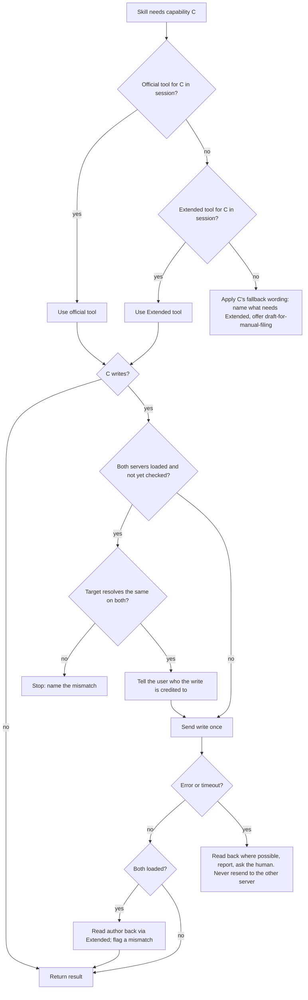
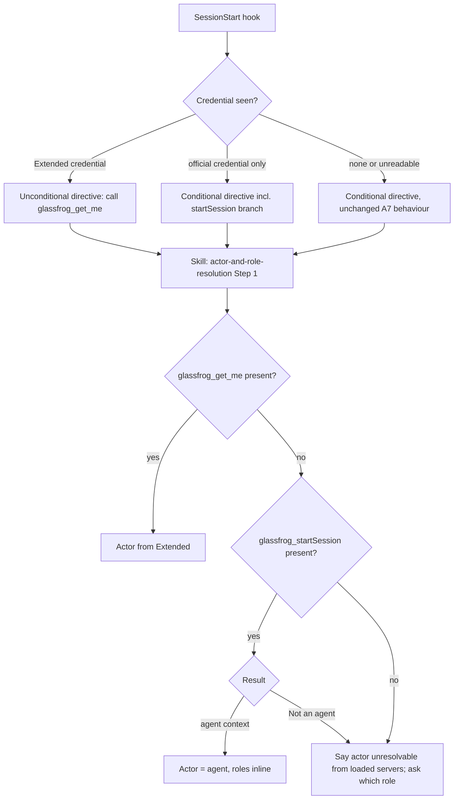
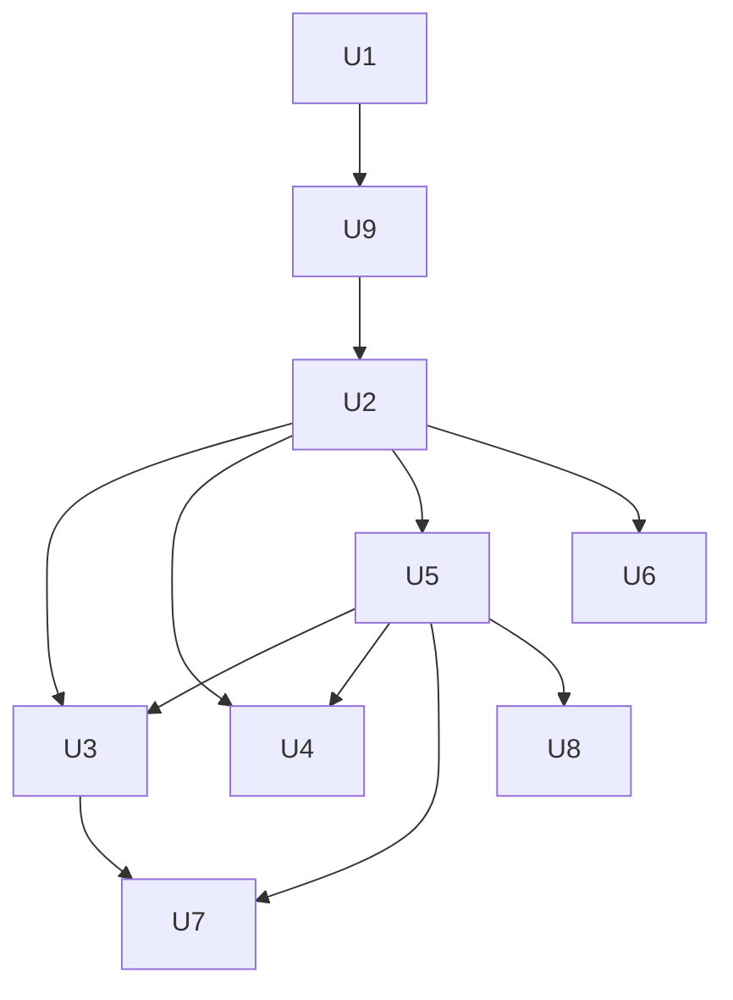

# Official GlassFrog MCP as the Default Connector - Plan

Tracking issue: [#340](https://github.com/Integral-Productivity/holacracy-claude-plugin/issues/340). Folds in [#337](https://github.com/Integral-Productivity/holacracy-claude-plugin/issues/337), [#338](https://github.com/Integral-Productivity/holacracy-claude-plugin/issues/338), and the server-awareness half of [#327](https://github.com/Integral-Productivity/holacracy-claude-plugin/issues/327).

---

## Goal Capsule

- **Objective:** Someone who installs the plugin and authorises only GlassFrog's own MCP can ground a session in their role and capture tensions, projects and actions. Each capability the official server lacks says plainly that it needs GlassFrog Extended, and Integral Productivity sessions keep every capability they have today.
- **Means:** Bundle both servers, route each capability to the official server first through one shared capability map, and fall back to Extended by tool presence (KTD1, KTD3).
- **Authority:** the Product Contract's requirements win on behaviour; KTDs win on mechanism within them; units override neither. The constitution and `skills/shared/authority-boundaries.md` outrank any capability-routing convenience.
- **Stop conditions:**
  - Stop and ask if the plugin-scoped official server cannot authenticate from Claude Code: GlassFrog's auth server supports neither dynamic client registration nor CIMD, and no pre-registered client ID is available (U9).
  - Stop and ask if any change would let a write reach both servers for one intent.
  - Stop and ask if the session-start directive's two existing first lines would have to change wording (it restarts the grounding measurement window, see ADR-0008).
- **Execution profile:** markdown-heavy plugin work plus bash and Python 3.9 test scripts; every new check ships with a mutation case.
- **Finish and ship:** `claude/*` branch PRs against `main`, `feat:` commits, auto-merge on green CI; the release PR release-please opens is the release act. U8 lands in `Integral-Productivity/claude-config`.

---

## Product Contract

### Summary

The plugin ships GlassFrog's official MCP (`https://app.glassfrog.com/api/v5/mcp`) beside GlassFrog Extended in `.mcp.json`. One shared capability map becomes the plugin's governance-data seam. For each capability it names the official tool, the Extended tool, and what to say when neither is present. Skills, commands and agents cite capabilities instead of hard-coding tool names. The session-start hook learns which server a credential belongs to, the eval harness grows an official-only leg and a both-servers leg, and a lint check stops dead tool names from coming back.

### Problem Frame

Today the plugin works only through GlassFrog Extended, a server Integral Productivity hosts. An outsider must trust and authorise a third-party server before the plugin can read their org, while GlassFrog now publishes its own MCP. The README tells them the plugin will not repoint (`README.md`, GlassFrog connector section), and ADR-0005 named "HolacracyOne's official MCP" as the trigger to revisit that.

A live capability diff on 2026-10-08 showed the official server cannot carry the plugin alone. It has 36 tools and lacks identity for human connections, tension reads and updates, the proposal lifecycle, checklists, metrics, goals and assignment writes. Removing Extended would break `/holacracy:governance`, `/holacracy:tension-triage`, `/holacracy:supersession-sweep` and `/holacracy:audit-portfolio` and the role grounding everything else starts from. The same research found the plugin already partly broken in ways this work must not paper over: eight tool names the skills cite exist on neither server (#337), the facilitator's connectivity probe calls one of them, and the coach agent's allowlist resolves to zero tools wherever the plugin's own server is not the one that loaded (#338).

### Key Decisions

- **Bundle both servers; official first per capability.** (session-settled: user-directed — chosen over shipping only the official server with Extended in a companion plugin: removing Extended breaks four commands and human grounding.) Governs R1, R2, R5.
- **Extended stays on in IP environments, enforced through claude-config.** (session-settled: user-directed — chosen over documenting it only.) Governs R12. Conflict call-out: claude-config is a snapshot and audit repo, not a deployer (its ADR-0001 and ADR-0008), so the enforcement is a check that fails when a snapshot shows Extended missing or disabled, and the setting itself lives in each machine's live config.
- **Attribution is checked around the write, not by comparing actors before it.** (session-settled: user-directed — chosen over routing human writes to Extended and over dropping the check: the official server never reports a human's identity, so a pre-write comparison cannot run in the normal IP session.) Governs R7.
- **Hook, eval harness and #337 are in scope.** (session-settled: user-directed — chosen over a connector-only change.) Governs R8, R9, R10, R11.

### Requirements

**Packaging**

- R1. The plugin's `.mcp.json` registers both GlassFrog's official MCP and GlassFrog Extended.
- R2. A user who authorises only the official server can resolve their role (when the connection is an agent's) or name it (when human), and capture tensions, projects and actions.

**Capability routing**

- R3. One shared reference owns, per capability, which tool to use on each server and what to say when neither is present; every skill, command and agent cites it rather than naming tools for those capabilities itself.
- R4. The server for a capability is chosen once, from the tools present in the session, and never by trying one and falling back on failure.
- R5. A capability only Extended provides tells the user it needs GlassFrog Extended and what they lose, rather than silently doing less.
- R6. A write is sent to exactly one server; after an error or timeout it is never retried on the other server, and the skill reads back state and asks the human.
- R7. When both servers are loaded, a write's attribution is protected: before the first write the skill confirms the target resolves identically on both servers and tells the user who the write will be credited to, and after the write it checks the recorded author and flags a mismatch.

**Integrity**

- R8. Every GlassFrog tool name cited in shipped markdown exists on a server the plugin bundles, and CI fails when one does not.
- R9. Shipped markdown carries no fully qualified `mcp__...` GlassFrog tool name except where a frontmatter allowlist cannot be expressed otherwise, and those cover every server name the tools can arrive under.

**Session start and evaluation**

- R10. The session-start hook never emits a directive the loaded servers cannot satisfy: an official-only credential does not trigger the `glassfrog_get_me` directive.
- R11. The behavioural eval exercises an official-only session and a both-servers session, and checks mechanically that one intent produces one write.

**IP environments**

- R12. In Integral Productivity environments exactly one GlassFrog Extended endpoint is configured and enabled, and a claude-config check fails when it is not.

### Success Criteria

- A fresh outsider install with only the official server authorised can run `/holacracy:capture-tension` end to end and gets a plain "needs GlassFrog Extended" message from `/holacracy:tension-triage`.
- The official-only and both-servers eval legs pass their mechanical assertions in a `workflow_dispatch` run.
- `skills-lint.sh` reports no dead tool name on `main`, and its mutation case for the new check passes.

### Scope Boundaries

**Non-goals**

- Changing GlassFrog Extended itself (its repo `Integral-Productivity/glassfrog-mcp-server`).
- Extracting a `glassfrog-claude-plugin` or a companion plugin; ADR-0005's deferral stands for packaging.
- Replacing GlassFrog as a backend or adding a second backend.
- Shipping Extended disabled by default: Claude Code has no per-server default-off for a plugin `.mcp.json` (docs: plugins-reference `defaultEnabled` is per plugin).
- Considered and not built: a heuristic that guesses a human's identity from `listPeople` or `search` when only the official server is loaded. Guessing an actor is the failure `actor-and-role-resolution.md` exists to prevent; GlassFrog exposing `/me` through its MCP would change the call.
- Considered and not built: automatic cross-server retry or reconciliation of failed writes. R6 rules it out; a reconciliation tool would only earn its place if eval runs show humans failing to recover from the read-back prompt.

### Deferred to Follow-Up Work

- The plain-text tension fallback `README.md` claims and `agents/tension-capture.md` lacks: [#348](https://github.com/Integral-Productivity/holacracy-claude-plugin/issues/348). Close it from U3's PR if U3 absorbs it.
- Asking GlassFrog to expose `/me`, `/me/roles`, tension reads and proposals through their MCP: [#349](https://github.com/Integral-Productivity/holacracy-claude-plugin/issues/349), an outward request for a human to make.
- Re-seeding `evals/benchmark.json` from a real `workflow_dispatch` run after U5 lands: [#350](https://github.com/Integral-Productivity/holacracy-claude-plugin/issues/350).

### Sources

- Live capability diff and probes, 2026-10-08: official `startSession` returns `Not an agent` for a human OAuth connection (with and without `role_id`); `readApiSpec` shows REST `/me`, `/me/roles`, `/me/context`, tension GET/PATCH/DELETE and metric CRUD exist but are not MCP tools; the same `role_` ID resolves identically on both servers.
- Claude Code docs (`code.claude.com/docs/en/mcp`, `.../managed-mcp`, `.../plugins-reference`): servers dedupe by endpoint with precedence local > project > user > plugin > claude.ai connector; no per-server default-off in a plugin; `.mcp.json` may pre-declare `oauth.clientId` / `callbackPort`; `managedMcpServers` pushes a remote server to every user but users can still toggle it off.
- `docs/adr/0005-holacracy-identity-glassfrog-as-first-connector-behind-a-seam.md` (the seam this plan builds), `docs/adr/0008-session-injected-honest-grounding-directive.md` (A5–A7), `docs/adr/0003-glassfrog-tension-api-adoption.md`, `docs/adr/0012-test-the-skills-not-just-the-scaffolding.md`, `docs/adr/0014-eval-hermeticity-by-config-dir-isolation-not-bare.md`.

---

## Planning Contract

### Key Technical Decisions

- KTD1. **Both servers in `.mcp.json`; the official one under the key `glassfrog-official`.** (session-settled: user-directed — chosen over an official-only bundle plus a companion plugin: the official server cannot ground humans or run four commands.) The key avoids `glassfrog`, whose stale empty OAuth records still sit in operator stores (ADR-0008 A7, #290), and reads as the pair of `glassfrog-extended`. Because Claude Code dedupes by endpoint, a user's claude.ai GlassFrog connector at the same URL is hidden behind the plugin copy, and a project- or user-scoped `glassfrog-extended` hides the plugin's Extended copy. Sessions run inside this repo already see that: its own `.mcp.json` loads Extended at project scope. Nothing may depend on which copy won (KTD4). Governs R1, R2.
- KTD2. **Server identity comes from the tool name's case, not the server name.** Official tools are camelCase (`glassfrog_createTension`), Extended's are snake_case (`glassfrog_create_tension`). That holds under any server key, claude.ai connector or plugin scope. The one collision is `glassfrog_search`, identical on both; the capability map treats search as server-agnostic. Governs R3, R4, R9.
- KTD3. **`skills/shared/glassfrog-capabilities.md` is the governance-data seam ADR-0005 committed to.** One row per capability: official tool, Extended tool, fallback wording when neither is present, and whether the capability writes. Selection rule, decided once per capability per session: official tool present → use it; else Extended tool present → use it; else apply the row's fallback. Per-skill tool tables become capability rows citing the map, following the single-owner precedent of `actor-and-role-resolution.md` Step 2 and lint check 7. The "older MCP server" wording in `commands/tension-triage.md` is the template for fallback text. The map classifies every official tool, including the writes no skill uses (`glassfrog_postMessage`, `glassfrog_markChannelRead`, `glassfrog_addTag`, `glassfrog_removeTag`, the note and skill writes) and the chat reads (`glassfrog_listMessages`, `glassfrog_getChannel`, `glassfrog_listChannels`), as never called by this plugin. Every needs-Extended fallback says that Extended is hosted by Integral Productivity and receives the user's GlassFrog API key, because that is where the user decides whether to authorise it. Governs R3, R4, R5.
- KTD4. **No fully qualified GlassFrog tool names in shipped markdown.** Bare names are the contract. The only exception is agent frontmatter allowlists, and only if Claude Code cannot express them by pattern (Open Questions). In that case the allowlist lists every name that can be enumerated: plugin-scoped `glassfrog-official` and `glassfrog-extended`, the project-scope `glassfrog-extended` names sessions inside this repo see, and the eval stubs' names. Names Cowork and claude.ai connectors assign (display-name and UUID forms) cannot be enumerated, so that branch cannot fully close #338. In both branches the write tools, the session tools and the chat reads are denied explicitly, because several official writes do not look like writes. Governs R9.
- KTD5. **Writes go to one server, chosen before the call; failures read back, never retry elsewhere.** The read-back is asymmetric: the official server cannot read tensions, so confirming an official `createTension` uses Extended `glassfrog_list_role_tensions` when present (with its known propagation lag, per `glassfrog-api-constraints.md`), and otherwise reports the returned ID and stops. After a timeout there is no ID, and an empty read-back proves nothing because Extended's tension list lags new writes. The skill then says the write may have landed, names where to check in GlassFrog, and never offers to refile on the strength of an empty read-back. Governs R6.
- KTD6. **Tension creation prefers the official server.** Its `createTension` takes `label` and `meeting_type`, which removes the topic-first-in-body workaround and the `meeting_type` 422 that Extended forces (ADR-0003, stub `evals/stub/glassfrog_stub.py`). Whether official `meeting_type` also rejects is unverified; U5's stub reproduces what U9's live smoke check finds. Governs R2, R6.
- KTD7. **Identity resolution has three branches plus a same-actor check, owned by `actor-and-role-resolution.md` Step 1:**
  1. A tool ending in `glassfrog_get_me` is present → use it (Extended).
  2. Otherwise `glassfrog_startSession` is present → call it with a per-Claude-session `topic`, so parallel Claude sessions acting as the same agent get separate GlassFrog sessions instead of replacing each other or hitting 409; success yields the agent and its roles. The capability map's write discipline ends that session with `glassfrog_endSession` when the skill's work completes (U2). An abruptly ended Claude session still leaves a GlassFrog session open (accepted risk; see Risks).
  3. `Not an agent`, or neither tool present → say the actor cannot be resolved from the loaded servers and ask which role to act as. No question is asked by the hook itself (ADR-0008 invariant 4).

  Attribution with both servers loaded follows R7. Before the first write, the skill resolves the target role on both servers and confirms the same record comes back, and tells the user the write is credited to whoever authorised the official server. After the write, it reads the tension's `sensed_by_id` through Extended `glassfrog_get_tension` and flags a mismatch with the actor resolved in branch 1. For an agent connection, branches 1 and 2 both name an actor, and they are compared directly before the write. Governs R2, R7.
- KTD8. **The session-start gate becomes server-aware.** It tells an Extended credential from an official one by the OAuth entry's server URL or name:
  - an Extended credential → today's unconditional `glassfrog_get_me` directive;
  - only an official credential → the conditional directive, whose body gains the `startSession` branch from KTD7;
  - neither → unchanged.

  Both directive forms keep their current first lines verbatim, because `scripts/grounding-readout.sh` counts firings by the first line. The hook itself never calls `startSession` and never asks a question; the branch is text the model acts on through `actor-and-role-resolution.md`, so ADR-0008's no-question invariant holds. Recorded as ADR-0008 amendment A8. Governs R10.
- KTD9. **Lint check 8 validates cited tool names against committed per-server inventories.** The inventories live at `evals/tool-inventory/official.txt` and `evals/tool-inventory/extended.txt`, as tool names only. A new script turns a `tools/list` response piped on stdin into a sorted name list, the same filter shape as `scripts/glassfrog-schema-capture.py`, so it needs no OAuth of its own. The inventories never contain response data, consistent with the no-real-GlassFrog-data rule. The check matches call-shaped or backticked `glassfrog_*` tokens in both cases, backticked bare snake names in the two files that use that form, and frontmatter allowlists. A short list of non-tool tokens (`glassfrog_stub` and the like) is exempt. Governs R8.
- KTD10. **The eval runner separates "loads the plugin" from "which MCP servers".** Legs become a pair (`loads_plugin`, `servers`):
  - `with_skill` loads the plugin with both stubs, so the generated config's keys match `.mcp.json` again;
  - `with_skill_official` loads the plugin with the official stub only;
  - `without_skill` keeps today's control.

  Every literal `config == "with_skill"` test becomes a predicate. A new official-shaped stub reproduces the official server's real gaps on purpose, including `Not an agent` from `startSession` and no tension reads. Write-log assertions check that one intent produces one create and that no Extended write follows an official failure. Governs R11.
- KTD11. **IP enablement is a claude-config check, not a deployment.** (session-settled: user-directed — chosen over docs only; see the Key Decision's conflict call-out.) The check in `checks/index.mjs` reads live config through the same `load()` path the existing checks use, because the snapshot's `~/.claude.json` subset drops `disabledMcpServers`. It fails unless it finds four things:
  1. `holacracy@integral-productivity-labs` is enabled;
  2. exactly one GlassFrog Extended endpoint is configured, at plugin, project or user scope;
  3. that endpoint is not in `disabledMcpServers`;
  4. no second definition of the same endpoint exists under another name.

  `managedMcpServers` is not used, because users can still toggle it off and it is not read in Cowork. Governs R12.
- KTD12. **New ADR-0017 records the repoint.** It supersedes the README's "stays on GlassFrog Extended" stance and ADR-0005's packaging-deferral context for the connector. It names `glassfrog-capabilities.md` as the seam's concrete form and notes ADR-0003's body-only constraint as Extended-specific. Release as `feat:`, not `feat!:`, which would take 0.x to 1.0.0. Governs R1, R3.

### High-Level Technical Design

Capability selection and write discipline, as the capability map states them:

Identity resolution (KTD7) and the hook's directive choice (KTD8):

Capability coverage the map starts from (live, 2026-10-08):

| Capability | Official | Extended | Without Extended |
|---|---|---|---|
| Resolve actor (human) | none | `glassfrog_get_me`, `glassfrog_list_my_roles` | ask for the role |
| Resolve actor (agent) | `glassfrog_startSession` | `glassfrog_get_me` | official covers |
| List roles / sub-roles | `glassfrog_listRoles` | `glassfrog_list_roles`, `glassfrog_list_sub_roles` | official covers |
| Domains | inline on `glassfrog_listRoles` / `glassfrog_getRole` | `glassfrog_list_role_domains` | official covers |
| Policies | `glassfrog_search` + `glassfrog_getPolicy` | `glassfrog_list_role_policies` | official covers, more calls |
| Create tension | `glassfrog_createTension` | `glassfrog_create_tension` | official covers |
| Read / update / delete tensions | none | `glassfrog_list_role_tensions`, `glassfrog_get_tension`, `glassfrog_update_tension`, `glassfrog_delete_tension` | needs Extended |
| Proposals | none | `glassfrog_create_proposal` and lifecycle | needs Extended |
| Projects and actions | `glassfrog_listProjects`, `glassfrog_createProject`, `glassfrog_updateProject`, action equivalents | `glassfrog_list_role_projects`, `glassfrog_create_role_project`, `glassfrog_update_project`, `glassfrog_create_action` | official covers; delete becomes archive |
| Checklists and metrics | none | `glassfrog_list_role_checklist_items`, `glassfrog_list_role_metrics` and writes | needs Extended |
| Goals, targets, strategy | none | `glassfrog_list_role_goals`, `glassfrog_get_role_strategy` and writes | skip the step, say so |
| Assignments | `glassfrog_listAssignments` (read) | `glassfrog_list_role_assignments`, `glassfrog_assign_actor_to_role`, `glassfrog_delete_assignment` | read covers; writes advisory |

### Assumptions

- GlassFrog's auth server lets Claude Code authenticate a plugin-scoped copy of the official server, through dynamic client registration or CIMD. The claude.ai connector working is evidence but not proof, because claude.ai may use a pre-registered client. U9 checks it before any other unit depends on it.
- Role, project and action IDs are shared across both servers (confirmed live for a role ID on 2026-10-08; assumed for the rest, since both front the same v5 API).

### Sequencing

U1 first: it makes the live repo lint-clean against real tool names, so every later unit builds on names that exist. U9's smoke check comes next, because the whole official-first design depends on its result. U2 defines the seam before U3 and U4 consume it. U5 needs U2's capability map for the stub contract, and must land `.mcp.json` and the runner change together because the runner's key-equality test breaks otherwise. U3 and U4 can be written once U2 lands but are verified against U5's legs. U6 can run beside U3–U5 once U2 lands. U7 follows U5. U8 lands in claude-config after U5 publishes the key name.

### System-Wide Impact

- **Claude Code sessions (outsiders):** two new `/mcp` entries. Official grounds agents and captures; Extended shows "needs authentication" until authorised. Four commands report the Extended requirement instead of running.
- **Claude Code sessions (IP operators):** Extended arrives at plugin scope, and at project scope inside this repo; the plugin's official copy replaces any claude.ai GlassFrog connector at the same URL. No capability is lost once both are authenticated.
- **Cowork and the desktop app:** remote plugin servers are offered as connectors rather than auto-loaded, and `managedMcpServers` is not read there. The capability map's presence-based routing works the same, because it never assumes which servers loaded.
- **Agent tool surfaces:** `holacracy-coach`'s allowlist is the only frontmatter that names tools; the capture agents and `project-critic` inherit all tools and follow the map. Write approval stays where it is today: per-item human confirmation in the capture flows, two-stage review for the coach.
- **Prompt context:** the session-start directive's body grows by one branch; its first lines and the grounding readout's counting do not change.
- **Eval and CI:** one more stub, one more leg, and a cache-key input; the nightly graded run costs roughly one extra leg per case, and `evals/benchmark.json` needs re-seeding once.
- **Release channels:** `feat:` minor release through release-please and `promote-stable.yml`; both install channels (labs and self-hosted) pick it up from `stable` with no install-line change.

### Risks

| Risk | Effect | Mitigation |
|---|---|---|
| The plugin's official copy hides a user's working claude.ai GlassFrog connector (same URL, plugin outranks connector) and starts unauthenticated | An existing GlassFrog user, Cowork included, loses GlassFrog until they sign in again; if the plugin copy cannot authenticate at all, they lose it outright | U9's smoke check runs before U2 and is a Goal Capsule stop condition; README states the re-sign-in |
| Agent sessions left open in GlassFrog when a Claude session ends abruptly (KTD7) | Residue in the agent's GlassFrog session list | A per-Claude-session `topic` keeps sessions separate; U9 records whether GlassFrog expires idle sessions |
| An Extended credential is stored but Extended's tools are absent (server toggled off, token revoked) | The unconditional directive asks for a tool that is not there | Pre-existing since A5; unchanged by this plan; the skill's identity branches still fall through to asking for the role |
| A project-scoped `glassfrog-extended` (this repo's own `.mcp.json`) or a Cowork connector hides the plugin's Extended copy | Anything pinned to the plugin's prefix sees no tools there | KTD4 forbids pinning; U4 covers every name that can be enumerated; U8 asserts a single Extended definition |

---

## Implementation Units

### U1. Tool inventories, lint check 8, and the dead names

- **Goal:** Every cited GlassFrog tool name resolves to a real tool, and CI keeps it that way.
- **Requirements:** R8; KTD9. Closes #337.
- **Dependencies:** none.
- **Files:**
  - `evals/tool-inventory/official.txt` (new)
  - `evals/tool-inventory/extended.txt` (new)
  - `scripts/glassfrog-tool-inventory.py` (new; reads a `tools/list` response on stdin)
  - `scripts/skills-lint.sh`
  - `scripts/skills-lint.test.sh`
  - every skill, command and reference citing a dead name (from #337 and the research):
    - `skills/holacracy-facilitator/SKILL.md` and its `references/`
    - `skills/holacracy-secretary/SKILL.md` and its `references/`
    - `skills/holacracy-lead-link/SKILL.md` and its `references/`
    - `skills/holacracy-rep-link/SKILL.md`
    - `skills/holacratic-ai-governance/SKILL.md` and `references/{engagement-patterns,governance-rooting,glassfrog-api-constraints}.md`
    - `commands/routines.md`
  - `CLAUDE.md` (check count and description)
  - `scripts/glassfrog-tool-inventory.test.sh` (new) and its step in `.github/workflows/scripts-test.yml`
- **Approach:**
  1. Pipe one live `tools/list` response per server through the new script, from an authenticated session, and commit the name lists with their capture date in a header comment.
  2. Add check 8 per KTD9. It fails on any cited name absent from both inventories.
  3. Rename every dead citation to its live Extended equivalent per #337's table, plus `glassfrog_list_projects` → `glassfrog_list_role_projects`.
     - `glassfrog_list_frequencies` has no equivalent. Rewrite that prose to read frequency off the checklist or metric record.
     - The facilitator's connectivity probe changes from `glassfrog_list_circles` to "any GlassFrog tool present in the session". U3 later points it at the capability map.
  4. Rewrite `glassfrog-api-constraints.md`'s v3 inventory table to current names, or move it to an allowlist entry with a reason. Prefer the rewrite.
  5. Bump `version:` on each touched skill (check 4).
- **Patterns to follow:** check 7's structure and frontmatter handling in `scripts/skills-lint.sh`; the `_fixture` + `sedi` mutation convention in `scripts/skills-lint.test.sh`.
- **Test scenarios:**
  - A fixture skill citing `glassfrog_get_circle` fails the full lint and passes with `SKILLS_LINT_SKIP=8`.
  - A fixture citing a camelCase official name (`glassfrog_listRoles`) present in `official.txt` passes.
  - A fixture citing a bare backticked `` `list_circles` `` in a file the check scans for bare names fails.
  - A fixture agent whose frontmatter `tools:` names a nonexistent tool fails.
  - The prose token `glassfrog_stub` in a README-style fixture passes.
  - The inventory script, fed a recorded `tools/list` fixture on stdin, emits sorted names only and no other field.
  - The live repo passes check 8 (the existing final live-repo case).
- **Verification:** `skills-lint.sh` is clean on the branch; `skills-lint.test.sh` passes with the new mutation case; grep for the eight dead names across `skills agents commands` returns nothing.

### U2. The capability map and identity resolution

- **Goal:** One shared reference decides, per capability, which server's tool to use, how to write safely, and how to resolve the actor.
- **Requirements:** R3, R4, R5, R6, R7; KTD2, KTD3, KTD5, KTD6, KTD7.
- **Dependencies:** U1.
- **Files:**
  - `skills/shared/glassfrog-capabilities.md` (new)
  - `skills/shared/actor-and-role-resolution.md`
  - `skills/shared/tension-capture-flow.md`
  - `skills/shared/project-capture-flow.md`
  - `scripts/skills-lint.test.sh` (only if check 6 or 7 fixtures need the new file)
- **Approach:**
  1. Write the map: the selection rule (KTD3), the case convention (KTD2), the write discipline (KTD5), and one row per capability seeded from the High-Level Technical Design table.
  2. Rewrite `actor-and-role-resolution.md` Step 1 into KTD7's three branches plus R7's before-and-after attribution check. Keep Step 2's bounded roster rule and its check 7 contract intact for the Extended path. For the official path, `startSession` returns roles inline, so no paging is needed.
  3. Point the two capture flows at the map for "create tension" and "create project/action", and record KTD6's label and `meeting_type` handling for the official path.
  4. State in the map's write discipline when an agent's GlassFrog session ends: the skill that started it calls `glassfrog_endSession` once its work completes (KTD7).
- **Patterns to follow:** the single-owner rule of `actor-and-role-resolution.md` Step 2; the fallback wording in `commands/tension-triage.md` ("If X is unavailable … use Y and say what it costs; if neither, name the gap").
- **Test scenarios:**
  - `skills-lint.sh` check 6 does not report the new map as orphaned once U2's citing files land.
  - Check 1 resolves every path to the map from `SKILL.md` (`../shared/`) and from `references/` (`../../shared/`).
  - Check 8 accepts every tool name the map cites.
  - Behavioural coverage is U5's (official-only leg), not this unit's; this unit is reference text.
- **Verification:** the map has a row for every capability any skill, command or agent uses. `actor-and-role-resolution.md` names all three identity branches and R7's attribution check. Lint is clean.

### U3. Skills, commands and agents cite capabilities

- **Goal:** Every surface that touches GlassFrog routes through the map and degrades with the map's wording.
- **Requirements:** R3, R4, R5; KTD3.
- **Dependencies:** U2.
- **Files:**
  - per-skill tool tables:
    - `skills/holacracy-lead-link/SKILL.md`
    - `skills/holacracy-facilitator/SKILL.md`
    - `skills/holacracy-secretary/SKILL.md`
    - `skills/holacracy-rep-link/SKILL.md`
    - `skills/holacratic-ai-governance/SKILL.md`
    - `skills/checklist-metric-audit/SKILL.md`
  - commands:
    - `commands/tension-triage.md`
    - `commands/supersession-sweep.md`
    - `commands/process-inbox.md`
    - `commands/governance.md`
    - `commands/audit-portfolio.md`
    - `commands/review-project.md`
    - `commands/stalled-project-sweep.md`
    - `commands/capture-tension.md`
    - `commands/capture-project.md`
  - agents: `agents/tension-capture.md`, `agents/project-capture.md`, `agents/project-critic.md`
  - `skills/holacracy-secretary/references/pre-tactical-prep-routine.md`
- **Approach:**
  1. Convert each per-skill `| Category | Tools | Used For |` table into capability rows that cite the map. Keep tool names only where a skill needs a server-specific detail, such as the tension list's direct-children-only defect.
  2. Rewrite the existing "want me to retry?" prompts in the capture flows, capture agents and sweeps so a retry stays on the server that took the first attempt and follows a read-back (KTD5).
  3. Give the four Extended-only commands an opening check: if the capability is absent, say it needs GlassFrog Extended, what that covers, and stop or offer draft-for-manual-filing per the map row.
  4. Point the facilitator's connectivity probe at the map.
  5. Bump each touched skill's `version:`.
- **Patterns to follow:** degradation pattern 1 ("name the limit and ask") and pattern 2 ("draft for manual filing") as catalogued in the research; `commands/tension-triage.md`'s existing fallback paragraph.
- **Test scenarios:**
  - Covered behaviourally by U5's official-only leg: `/holacracy:tension-triage` reports the needs-Extended message and makes no write.
  - Covered behaviourally by U5's official-only leg: `/holacracy:capture-tension` files through `glassfrog_createTension` with a `label`.
  - Static: check 8 passes and no per-skill table names a tool the map does not list.
- **Verification:** every listed file cites `glassfrog-capabilities.md` for its GlassFrog capabilities; lint is clean; version bumps present.

### U4. Coach allowlist across server names

- **Goal:** The `holacracy-coach` subagent has read access to GlassFrog under every server name the tools arrive as, and stays read-only.
- **Requirements:** R9; KTD4. Closes #338.
- **Dependencies:** U2; verified against U5's two-stub harness.
- **Files:** `agents/holacracy-coach.md`, `scripts/skills-lint.test.sh` (case 7c's fixture prefix).
- **Approach:**
  1. Resolve the Open Question on frontmatter patterns first.
  2. If Claude Code accepts a server-wildcard pattern in `tools:`, express the allowlist by read-tool suffix. The PR closes #338.
  3. Otherwise list each read tool under every enumerable name per KTD4. The PR references #338 without closing it and records the Cowork and connector names it cannot cover.
  4. In either branch, deny the write tools, the session tools and the chat reads explicitly in `disallowedTools:` (KTD3's list), and add the official read tools from the map.
- **Patterns to follow:** the current split between `tools:` and `disallowedTools:` in `agents/holacracy-coach.md`.
- **Test scenarios:**
  - Check 8 validates every name in both frontmatter lists against the inventories.
  - Neither frontmatter list grants `glassfrog_postMessage`, `glassfrog_listMessages` or `glassfrog_startSession` under any name or pattern.
  - A `--validate-only` eval preflight with the plugin loaded registers the coach and shows GlassFrog read tools in its allowlist resolution under the eval's stub server names.
- **Verification:** the coach resolves GlassFrog read tools in a session where Extended arrives at project scope, which is the condition #338 documents and this repo reproduces.

### U5. Bundle the official server, and the eval harness for two servers

- **Goal:** The plugin ships both servers, and the nightly eval proves the official-only and both-servers sessions behave.
- **Requirements:** R1, R2, R6, R11; KTD1, KTD6, KTD10.
- **Dependencies:** U2.
- **Files:**
  - `.mcp.json`
  - `evals/stub/glassfrog_official_stub.py` (new)
  - `evals/stub/glassfrog_stub.py` (only if shared helpers are factored out)
  - `scripts/run-behavioural-eval.py`
  - `scripts/run-behavioural-eval.test.sh`
  - `scripts/evals-harness.test.sh`
  - `evals/cases/tension-triage/evals.json`
  - `evals/cases/capture-tension/evals.json`
  - a new case directory for official-only capture, `evals/cases/capture-tension-official/evals.json`
  - `.github/workflows/scripts-test.yml` (if a new test script is added)
- **Approach:**
  1. Add `glassfrog-official` → `https://app.glassfrog.com/api/v5/mcp` (HTTP) to `.mcp.json`. Add an `oauth` block only if U9 showed dynamic registration is unavailable and GlassFrog supplied a client ID.
  2. Write the official stub. It serves the official tools the map uses, under camelCase names. `startSession` returns `Not an agent` for the default human fixture and agent context for an agent fixture. It serves no tension reads.
  3. Replace every literal `config == "with_skill"` with a `loads_plugin` predicate, and give `mcp_config` a server set. The default leg emits both keys, which restores the `.mcp.json` key-equality test. Add the `with_skill_official` leg.
  4. Extend the session-shape check: the official leg fails if any Extended tool is registered.
  5. Add write-log assertions across both stubs: exactly one create per intent; no Extended write after an official failure. Every existing `no_write_of` and ordering assertion that names `glassfrog_create_tension` also names `glassfrog_createTension`, or an unconfirmed official write would pass unseen.
  6. Make the cache key cover the new leg: hash the official stub, route `resolve_skill_dirs_for_leg` through the same `loads_plugin` predicate so the official leg hashes the plugin's skills, and add `.mcp.json` to the input classes if `mcp_config` reads it.
- **Patterns to follow:** `evals/stub/glassfrog_stub.py` reproducing live defects on purpose; the fake-executor approach in `scripts/run-behavioural-eval.test.sh`; ADR-0014 hermeticity.
- **Test scenarios:**
  - The generated MCP config for the default leg has exactly the keys in `.mcp.json`.
  - The `with_skill_official` leg's `system/init` lists no Extended tool; a mutant that leaks one is caught by the shape check.
  - A leg named anything other than the known pair is rejected rather than silently run as a control.
  - The fake executor scripts an official `createTension` that times out followed by an Extended `glassfrog_create_tension`; the write-log assertion fails the run.
  - The fake executor scripts one `createTension` with `label`; the assertion passes and the stub log records the label.
  - A capture-tension case where the scripted model calls `glassfrog_createTension` before confirmation fails `no_write_of`.
  - The official leg's cache key differs from the default leg's and changes when a skill file changes.
  - The official stub returns `Not an agent` from `startSession` for the human fixture; a scripted grounding attempt then produces no write and a role question in the transcript.
  - Both stubs loaded, human fixture: an official `createTension` whose author the Extended stub reports as a different person produces a flagged mismatch in the transcript.
  - `--validate-only` starts both legs without credentials and reports the registered servers.
- **Verification:**
  - `run-behavioural-eval.test.sh` and `evals-harness.test.sh` pass offline.
  - `--validate-only` shows `with_skill` with both stub servers and `with_skill_official` with one.
  - The official stub's behaviour matches U9's recorded findings.

### U6. Server-aware session-start gate

- **Goal:** The session-start directive matches the servers the credential actually reaches.
- **Requirements:** R10; KTD7, KTD8. Addresses #327's server-awareness.
- **Dependencies:** U2.
- **Files:**
  - `hooks-handlers/session-start.sh`
  - `hooks-handlers/session-start.test.sh`
  - `hooks/hooks.json` (stale description since A7)
  - `docs/adr/0008-session-injected-honest-grounding-directive.md` (amendment A8)
  - `scripts/keychain-gate-live-check.sh` (only if its assertions name the gate's matching rule)
- **Approach:**
  1. Classify each readable OAuth entry as Extended or official, by server URL first and name second. The substring `glassfrog` match no longer decides alone.
  2. Choose the directive per KTD8.
  3. Add the `startSession` branch to the conditional form's body. Leave both first lines byte-identical.
  4. Write A8 recording the classification, the new branch, and that the measurement window does not restart.
- **Patterns to follow:** A5–A7's amendment format in ADR-0008; the existing Keychain fixtures at `hooks-handlers/session-start.test.sh` (the `plugin:holacracy:glassfrog-extended|abc123` entries).
- **Test scenarios:**
  - Fixture with only an official-server credential (non-empty token): output is the conditional form, contains `startSession`, contains no unconditional `glassfrog_get_me` demand.
  - Fixture with an Extended credential: output is today's unconditional form, unchanged byte for byte.
  - Fixture with both: unconditional form (Extended can ground humans).
  - Fixture with an empty-token Extended entry and a valid official entry: conditional form.
  - Neither form's first line changes; the readout's marker derivation still finds both.
  - Runtime overhead stays within the current budget measured by the existing timing assertions.
- **Verification:** `session-start.test.sh` passes, including the new cases. `scripts/grounding-readout.sh` on a fixture transcript counts both directive forms. ADR-0008 carries A8.

### U7. Documentation and ADR-0017

- **Goal:** Users and contributors read an accurate account of the two servers.
- **Requirements:** R1, R3, R5; KTD12.
- **Dependencies:** U3, U5.
- **Files:**
  - `README.md` (GlassFrog connector, install, Working without GlassFrog)
  - `CLAUDE.md` (GlassFrog MCP section; lint check count)
  - `docs/adr/0017-official-glassfrog-mcp-is-the-default-connector.md` (new)
  - `docs/adr/0005-holacracy-identity-glassfrog-as-first-connector-behind-a-seam.md` (status line pointing to 0017)
  - `docs/adr/0003-glassfrog-tension-api-adoption.md` (note that body-only is Extended-specific)
  - `CONCEPTS.md` (only if "capability map" needs an entry)
  - `.claude-plugin/plugin.json` (`description` only, never `version`)
- **Approach:**
  - **README** gets five changes:
    - name both servers and their roles;
    - correct the official tool count;
    - say outsiders will see a one-time "needs authentication" notice for Extended, what authorising it adds, and that it sends their GlassFrog API key to a server Integral Productivity hosts;
    - note that the plugin's official copy hides an existing claude.ai GlassFrog connector at the same URL, which then needs its own sign-in;
    - list which commands need Extended.
  - **ADR-0017** records KTD1–KTD3 and the capability-diff evidence.
  - Run the install-channel checks unchanged; the install lines do not move.
- **Test scenarios:**
  - `install-channel-check.sh --local-only` passes.
  - `skills-lint.sh` passes, including path resolution in the new ADR.
- **Verification:** no document still claims the plugin stays on Extended only or that the official server has 17 tools.

### U8. claude-config check for Extended in IP environments

- **Target repo:** `Integral-Productivity/claude-config`
- **Goal:** An IP machine whose snapshot shows Extended missing, disabled or duplicated fails the claude-config check suite.
- **Requirements:** R12; KTD11.
- **Dependencies:** U5 (the official key name and the final Extended key).
- **Files:**
  - `checks/index.mjs`
  - `checks/index.test.mjs`
  - `checks/fixtures/` (new fixtures)
  - `docs/adr/` (an ADR for the new check, if that repo's convention requires one per check)
- **Approach:**
  1. Read `enabledPlugins`, the MCP servers at each scope, and the per-project `disabledMcpServers` through `load()`, as the existing checks do.
  2. Fail with a named reason on each of the four conditions in KTD11.
  3. Separately, on the operator's live machine, confirm Extended has exactly one definition. Today there is none at user scope; it arrives at plugin scope, and at project scope inside this repo. Remove the dead permission rules `mcp__61b1667e-…__glassfrog_list_circles` and the like, then let the next snapshot record the result. That is a live edit, not a code change.
- **Patterns to follow:** existing checks in `checks/index.mjs` that read `enabledPlugins`; that repo's fixture-driven `index.test.mjs`.
- **Test scenarios:**
  - Fixture with the plugin enabled and Extended defined once, at plugin scope: passes.
  - Fixture with Extended present in `disabledMcpServers`: fails naming the project scope.
  - Fixture with two definitions of the Extended URL under different names: fails naming both.
  - Fixture with the holacracy plugin disabled: fails.
- **Verification:** that repo's test suite passes in its macOS merge queue, and the current machine's live config passes the new check.

### U9. Live smoke check of the official server

- **Goal:** Before the design depends on it, establish that a plugin-scoped official server authenticates from Claude Code and how its writes behave.
- **Requirements:** R1, R2; KTD1, KTD6, KTD7.
- **Dependencies:** U1.
- **Files:** none committed. The findings land in U5's official stub header and, if authentication needs one, the `oauth` block U5 adds.
- **Execution note:** This is a runtime probe, not code. Stop and ask if authentication cannot complete.
- **Approach:**
  1. In a scratch checkout, add `glassfrog-official` to `.mcp.json` and authenticate through `/mcp`. Record whether OAuth completes by dynamic registration, by CIMD, or not at all.
  2. Against a sandbox role named for the purpose (not a live working role), call `glassfrog_createTension` with `label` and `meeting_type`. Record the result, then delete the tension through Extended.
  3. Call `glassfrog_startSession` with a `topic`, then leave it unended. Record whether GlassFrog lists or expires it.
  4. If an agent credential is available, repeat step 3 as the agent and record what `startSession` returns.
- **Test expectation:** none -- a recorded probe; U5's stub tests encode its results.
- **Verification:** the four findings are written down before U2 starts, and the Goal Capsule stop condition is either cleared or raised to the user.

---

## Verification Contract

| Gate | Command | Applies to |
|---|---|---|
| Live smoke check, recorded | manual, per U9 | U9 |
| Static skill integrity | `bash scripts/skills-lint.sh --base origin/main` | U1–U4, U7 |
| Lint's own mutation suite | `bash scripts/skills-lint.test.sh` | U1, U2, U4 |
| Eval runner suite (offline, fake model) | `bash scripts/run-behavioural-eval.test.sh` | U5 |
| Fixture harness suite | `bash scripts/evals-harness.test.sh` | U5 |
| Session-shape preflight, no credentials | `python3 scripts/run-behavioural-eval.py --out <tmp> --validate-only --case evals/cases/tension-triage/evals.json` | U4, U5 |
| Cache-key pairing | `bash scripts/cache-key-completeness-check.sh` | U5 |
| Test wiring into CI | `bash scripts/test-wiring-check.sh` | any unit adding a `*.test.sh` |
| Hook suite | `bash hooks-handlers/session-start.test.sh` | U6 |
| Install channel | `bash scripts/install-channel-check.sh --local-only` and `bash scripts/install-channel-check.test.sh` | U7 |
| Shellcheck at the pinned version | `shellcheck` matching `SHELLCHECK_VERSION` in `.github/workflows/scripts-test.yml` | U1, U5, U6 |
| Python 3.9 compatibility | run new Python under the Bash tool's `python3` (Xcode 3.9.6) | U1, U5 |
| Graded behavioural run | `workflow_dispatch` of `.github/workflows/skills-eval.yml` after merge | U5 (evidence for Success Criteria) |
| claude-config suite | that repo's `checks/index.test.mjs` runner | U8 |

Bash changes are checked under both BSD and GNU tools before pushing.

---

## Definition of Done

- All Verification Contract gates for the units shipped pass on the PR branch, and CI is green.
- `.mcp.json` registers `glassfrog-extended` and `glassfrog-official`; the plugin `version` was not hand-edited and the release PR carries a minor bump.
- #337 is closed by U1's PR (`Closes #337`); #338 is closed by U4's PR only on the wildcard branch, and otherwise stays open with the uncovered names recorded; #340 closes when U7 merges; #327's state is read back and updated with what U6 changed.
- U9's findings (OAuth outcome, official `meeting_type` behaviour, idle-session expiry, agent-path result where an agent credential was available) are recorded in the official stub's header.
- ADR-0017 is accepted and ADR-0008 carries A8.
- The U8 check passes against a fresh snapshot of an IP machine.
- No abandoned-attempt code, commented-out fallbacks or unused stub tools remain in the diff.

**Per unit:** each unit's Verification line holds, and each touched skill's `version:` moved.

---

## Open Questions

- **Deferred to U4: do agent frontmatter `tools:` and `disallowedTools:` accept a server-wildcard pattern?** The answer picks between U4's two approaches. Resolve with one `--validate-only` probe or the Claude Code docs before editing the coach.
- **Deferred to U9: does GlassFrog's auth server support dynamic client registration or CIMD for a plugin-scoped client?** If neither, work stops for a client ID from GlassFrog (Goal Capsule stop condition).
- **Deferred to U9: does official `createTension` accept `meeting_type`, or 422 as Extended does?** U5's stub reproduces whichever U9 observes.
- **Deferred to U9: does GlassFrog expire an agent session that is never ended?** Decides whether the open-session risk needs more than a per-session `topic`.
